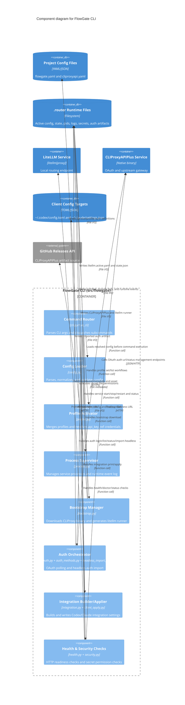

# C4 Level 3: Component Diagram (FlowGate CLI)

This diagram focuses on internal components of the `flowgate` CLI container (`src/flowgate`).

```mermaid
C4Component
  title Component diagram for FlowGate CLI

  ContainerDb(configFiles, "Project Config Files", "YAML/JSON", "flowgate.yaml and cliproxyapi.yaml")
  ContainerDb(runtimeFiles, ".router Runtime Files", "Filesystem", "Active config, state, pids, logs, secrets, auth artifacts")
  Container(litellmSvc, "LiteLLM Service", "litellm[proxy]", "Local routing endpoint")
  Container(cliproxySvc, "CLIProxyAPIPlus Service", "Native binary", "OAuth and upstream gateway")
  ContainerDb(clientFiles, "Client Config Targets", "TOML/JSON", "~/.codex/config.toml and ~/.claude/settings.json")
  System_Ext(githubReleases, "GitHub Releases API", "CLIProxyAPIPlus artifact source")

  Container_Boundary(flowgateCli, "FlowGate CLI (src/flowgate)") {
    Component(cmdRouter, "Command Router", "cli.py/run_cli", "Parses CLI args and dispatches subcommands")
    Component(configLoader, "Config Loader", "config.py", "Parses, normalizes, and validates config")
    Component(profileEngine, "Profile Activator", "profile.py", "Merges profiles and resolves api_key_ref credentials")
    Component(supervisor, "Process Supervisor", "process.py", "Manages service processes and runtime event log")
    Component(bootstrapMgr, "Bootstrap Manager", "bootstrap.py", "Downloads CLIProxy binary and generates litellm runner")
    Component(authFlow, "Auth Orchestrator", "oauth.py + auth_methods.py + headless_import.py", "OAuth polling and headless auth import")
    Component(integrationWriter, "Integration Builder/Applier", "integration.py + client_apply.py", "Builds and writes Codex/Claude integration settings")
    Component(healthChecks, "Health & Security Checks", "health.py + security.py", "HTTP readiness checks and secret permission checks")
  }

  Rel(cmdRouter, configLoader, "Loads resolved config before command execution", "Function call")
  Rel(configLoader, configFiles, "Reads service/profile/auth definitions", "File I/O")

  Rel(cmdRouter, profileEngine, "Handles profile set/list workflows", "Function call")
  Rel(profileEngine, runtimeFiles, "Writes litellm.active.yaml and state.json", "File I/O")

  Rel(cmdRouter, supervisor, "Handles service start/stop/restart and status", "Function call")
  Rel(supervisor, runtimeFiles, "Writes pid files, process logs, and runtime events", "File I/O")

  Rel(cmdRouter, bootstrapMgr, "Handles bootstrap download", "Function call")
  Rel(bootstrapMgr, githubReleases, "Fetches release metadata and asset", "HTTPS")
  Rel(bootstrapMgr, runtimeFiles, "Writes CLIProxyAPIPlus and litellm runner", "File I/O")

  Rel(cmdRouter, authFlow, "Handles auth login/list/status/import-headless", "Function call")
  Rel(authFlow, cliproxySvc, "Calls OAuth auth-url/status management endpoints", "JSON/HTTP")
  Rel(authFlow, runtimeFiles, "Writes imported auth artifact", "File I/O")

  Rel(cmdRouter, integrationWriter, "Handles integration print/apply", "Function call")
  Rel(integrationWriter, clientFiles, "Writes client config and backup files", "File I/O")

  Rel(cmdRouter, healthChecks, "Handles health/doctor/status checks", "Function call")
  Rel(healthChecks, litellmSvc, "Probes readiness URL", "HTTP")
  Rel(healthChecks, cliproxySvc, "Probes readiness URL", "HTTP")
  Rel(healthChecks, runtimeFiles, "Validates secret file permissions", "File metadata")
```
