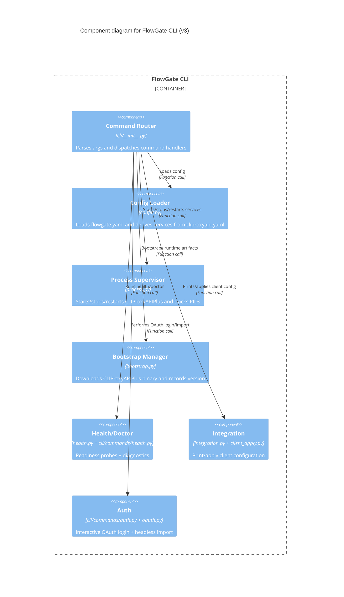

# C4 Level 3: Components (FlowGate CLI, v3)

```mermaid
C4Component
  title Component diagram for FlowGate CLI (v3)

  Container_Boundary(cli, "FlowGate CLI") {
    Component(cmdRouter, "Command Router", "cli/__init__.py", "Parses args and dispatches command handlers")
    Component(cfg, "Config Loader", "config.py", "Loads flowgate.yaml and derives services from cliproxyapi.yaml")
    Component(process, "Process Supervisor", "process.py", "Starts/stops/restarts CLIProxyAPIPlus and tracks PIDs")
    Component(bootstrapMgr, "Bootstrap Manager", "bootstrap.py", "Downloads CLIProxyAPIPlus binary and records version")
    Component(healthChecks, "Health/Doctor", "health.py + cli/commands/health.py", "Readiness probes + diagnostics")
    Component(integration, "Integration", "integration.py + client_apply.py", "Print/apply client configuration")
    Component(auth, "Auth", "cli/commands/auth.py + oauth.py", "Interactive OAuth login + headless import")
  }

  Rel(cmdRouter, cfg, "Loads config", "Function call")
  Rel(cmdRouter, process, "Starts/stops/restarts services", "Function call")
  Rel(cmdRouter, bootstrapMgr, "Bootstraps runtime artifacts", "Function call")
  Rel(cmdRouter, healthChecks, "Runs health/doctor", "Function call")
  Rel(cmdRouter, integration, "Prints/applies client config", "Function call")
  Rel(cmdRouter, auth, "Performs OAuth login/import", "Function call")
```

