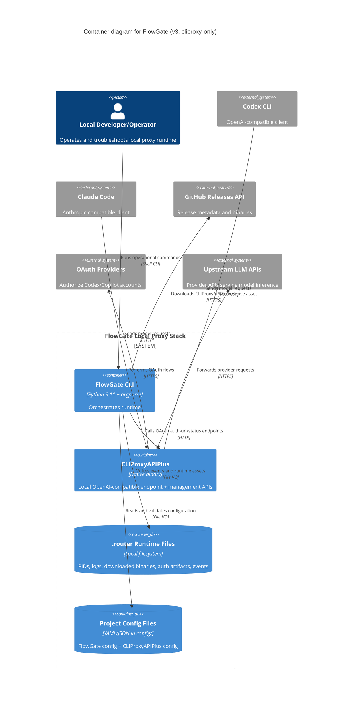

# C4 Level 2: Container Diagram (v3)

```mermaid
C4Container
  title Container diagram for FlowGate (v3, cliproxy-only)

  Person(operator, "Local Developer/Operator", "Operates and troubleshoots local proxy runtime")
  System_Ext(codexClient, "Codex CLI", "OpenAI-compatible client")
  System_Ext(claudeClient, "Claude Code", "Anthropic-compatible client")
  System_Ext(githubReleases, "GitHub Releases API", "Release metadata and binaries")
  System_Ext(oauthProviders, "OAuth Providers", "Authorize Codex/Copilot accounts")
  System_Ext(upstreamLlmApis, "Upstream LLM APIs", "Provider APIs serving model inference")

  System_Boundary(flowgateSystem, "FlowGate Local Proxy Stack") {
    Container(cli, "FlowGate CLI", "Python 3.11 + argparse", "Orchestrates runtime")
    Container(cliproxy, "CLIProxyAPIPlus", "Native binary", "Local OpenAI-compatible endpoint + management APIs")
    ContainerDb(runtimeFiles, ".router Runtime Files", "Local filesystem", "PIDs, logs, downloaded binaries, auth artifacts, events")
    ContainerDb(configFiles, "Project Config Files", "YAML/JSON in config/", "FlowGate config + CLIProxyAPIPlus config")
  }

  Rel(operator, cli, "Runs operational commands", "Shell CLI")
  Rel(cli, configFiles, "Reads and validates configuration", "File I/O")
  Rel(cli, runtimeFiles, "Writes events and runtime assets", "File I/O")
  Rel(cli, githubReleases, "Downloads CLIProxyAPIPlus release asset", "HTTPS")
  Rel(cli, cliproxy, "Starts/stops/restarts and probes readiness", "Subprocess + HTTP")
  Rel(cli, cliproxy, "Calls OAuth auth-url/status endpoints", "HTTP")

  Rel(codexClient, cliproxy, "Sends model requests", "HTTP /v1")
  Rel(claudeClient, cliproxy, "Sends model requests", "HTTP")
  Rel(cliproxy, oauthProviders, "Performs OAuth flows", "HTTPS")
  Rel(cliproxy, upstreamLlmApis, "Forwards provider requests", "HTTPS")
```

