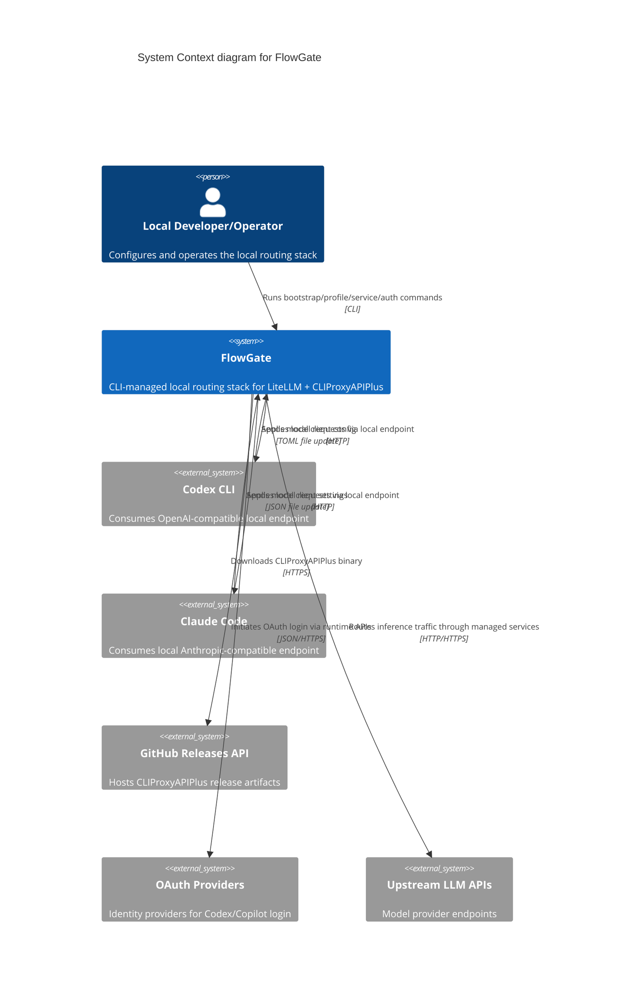

# C4 Level 1: System Context

This diagram shows FlowGate as a local routing control system and its external actors/systems.

```mermaid
C4Context
  title System Context diagram for FlowGate

  Person(operator, "Local Developer/Operator", "Configures and operates the local routing stack")
  System(flowgate, "FlowGate", "CLI-managed local routing stack for LiteLLM + CLIProxyAPIPlus")

  System_Ext(codexClient, "Codex CLI", "Consumes OpenAI-compatible local endpoint")
  System_Ext(claudeClient, "Claude Code", "Consumes local Anthropic-compatible endpoint")
  System_Ext(githubReleases, "GitHub Releases API", "Hosts CLIProxyAPIPlus release artifacts")
  System_Ext(oauthProviders, "OAuth Providers", "Identity providers for Codex/Copilot login")
  System_Ext(upstreamLlmApis, "Upstream LLM APIs", "Model provider endpoints")

  Rel(operator, flowgate, "Runs bootstrap/profile/service/auth commands", "CLI")
  Rel(flowgate, githubReleases, "Downloads CLIProxyAPIPlus binary", "HTTPS")
  Rel(flowgate, codexClient, "Applies local client config", "TOML file update")
  Rel(flowgate, claudeClient, "Applies local client settings", "JSON file update")
  Rel(codexClient, flowgate, "Sends model requests via local endpoint", "HTTP")
  Rel(claudeClient, flowgate, "Sends model requests via local endpoint", "HTTP")
  Rel(flowgate, oauthProviders, "Initiates OAuth login via runtime APIs", "JSON/HTTPS")
  Rel(flowgate, upstreamLlmApis, "Routes inference traffic through managed services", "HTTP/HTTPS")
```
