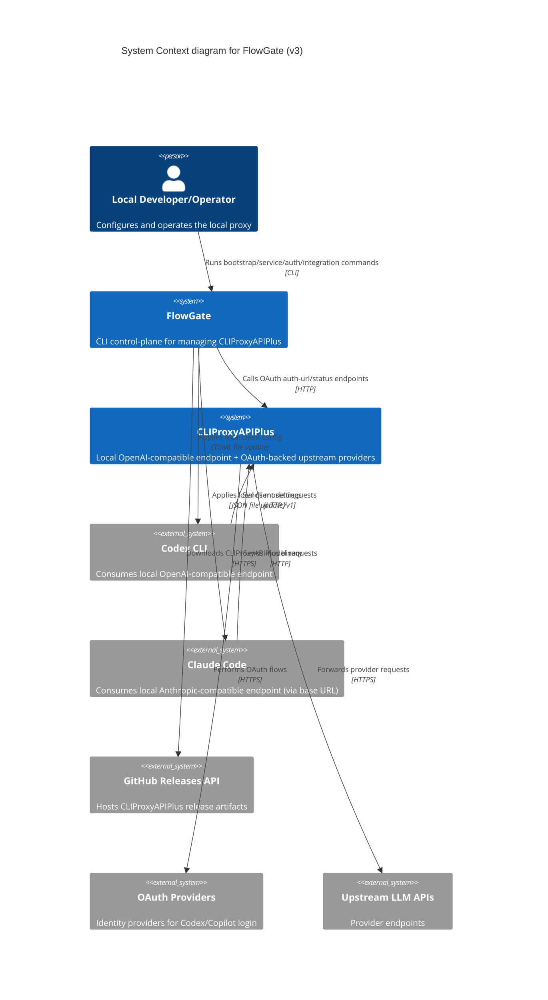

# C4 Level 1: System Context (v3)

```mermaid
C4Context
  title System Context diagram for FlowGate (v3)

  Person(operator, "Local Developer/Operator", "Configures and operates the local proxy")
  System(flowgate, "FlowGate", "CLI control-plane for managing CLIProxyAPIPlus")
  System(cliproxy, "CLIProxyAPIPlus", "Local OpenAI-compatible endpoint + OAuth-backed upstream providers")

  System_Ext(codexClient, "Codex CLI", "Consumes local OpenAI-compatible endpoint")
  System_Ext(claudeClient, "Claude Code", "Consumes local Anthropic-compatible endpoint (via base URL)")
  System_Ext(githubReleases, "GitHub Releases API", "Hosts CLIProxyAPIPlus release artifacts")
  System_Ext(oauthProviders, "OAuth Providers", "Identity providers for Codex/Copilot login")
  System_Ext(upstreamLlmApis, "Upstream LLM APIs", "Provider endpoints")

  Rel(operator, flowgate, "Runs bootstrap/service/auth/integration commands", "CLI")
  Rel(flowgate, githubReleases, "Downloads CLIProxyAPIPlus binary", "HTTPS")
  Rel(flowgate, cliproxy, "Starts/stops/restarts and probes readiness", "Subprocess + HTTP")
  Rel(flowgate, cliproxy, "Calls OAuth auth-url/status endpoints", "HTTP")

  Rel(flowgate, codexClient, "Applies local client config", "TOML file update")
  Rel(flowgate, claudeClient, "Applies local client settings", "JSON file update")
  Rel(codexClient, cliproxy, "Sends model requests", "HTTP /v1")
  Rel(claudeClient, cliproxy, "Sends model requests", "HTTP")

  Rel(cliproxy, oauthProviders, "Performs OAuth flows", "HTTPS")
  Rel(cliproxy, upstreamLlmApis, "Forwards provider requests", "HTTPS")
```

