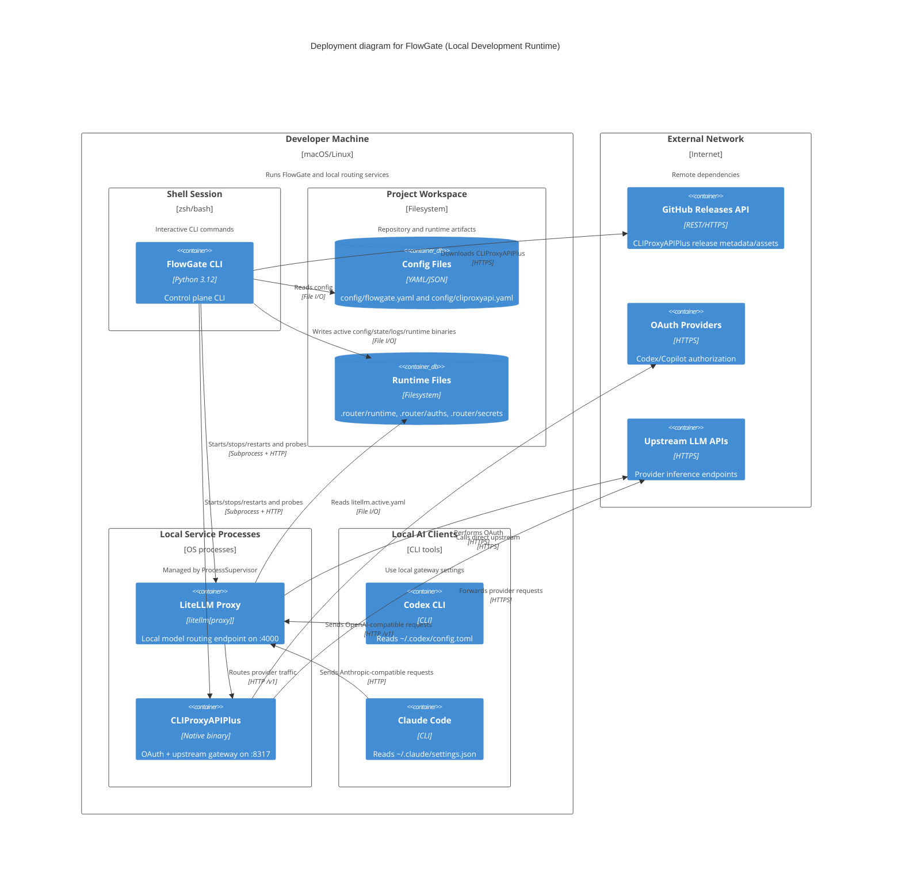

# C4 Level 4: Deployment Diagram

This diagram shows how FlowGate is deployed in a typical local developer environment.

```mermaid
C4Deployment
  title Deployment diagram for FlowGate (Local Development Runtime)

  Deployment_Node(devMachine, "Developer Machine", "macOS/Linux", "Runs FlowGate and local routing services") {
    Deployment_Node(userShell, "Shell Session", "zsh/bash", "Interactive CLI commands") {
      Container(flowgateCli, "FlowGate CLI", "Python 3.12", "Control plane CLI")
    }

    Deployment_Node(projectDir, "Project Workspace", "Filesystem", "Repository and runtime artifacts") {
      ContainerDb(configFiles, "Config Files", "YAML/JSON", "config/flowgate.yaml and config/cliproxyapi.yaml")
      ContainerDb(runtimeFiles, "Runtime Files", "Filesystem", ".router/runtime, .router/auths, .router/secrets")
    }

    Deployment_Node(localServices, "Local Service Processes", "OS processes", "Managed by ProcessSupervisor") {
      Container(litellmSvc, "LiteLLM Proxy", "litellm[proxy]", "Local model routing endpoint on :4000")
      Container(cliproxySvc, "CLIProxyAPIPlus", "Native binary", "OAuth + upstream gateway on :8317")
    }

    Deployment_Node(localClients, "Local AI Clients", "CLI tools", "Use local gateway settings") {
      Container(codexCli, "Codex CLI", "CLI", "Reads ~/.codex/config.toml")
      Container(claudeCode, "Claude Code", "CLI", "Reads ~/.claude/settings.json")
    }
  }

  Deployment_Node(externalNet, "External Network", "Internet", "Remote dependencies") {
    Container(githubApi, "GitHub Releases API", "REST/HTTPS", "CLIProxyAPIPlus release metadata/assets")
    Container(oauthProvider, "OAuth Providers", "HTTPS", "Codex/Copilot authorization")
    Container(upstreamApis, "Upstream LLM APIs", "HTTPS", "Provider inference endpoints")
  }

  Rel(flowgateCli, configFiles, "Reads config", "File I/O")
  Rel(flowgateCli, runtimeFiles, "Writes active config/state/logs/runtime binaries", "File I/O")
  Rel(flowgateCli, litellmSvc, "Starts/stops/restarts and probes", "Subprocess + HTTP")
  Rel(flowgateCli, cliproxySvc, "Starts/stops/restarts and probes", "Subprocess + HTTP")
  Rel(flowgateCli, githubApi, "Downloads CLIProxyAPIPlus", "HTTPS")

  Rel(codexCli, litellmSvc, "Sends OpenAI-compatible requests", "HTTP /v1")
  Rel(claudeCode, litellmSvc, "Sends Anthropic-compatible requests", "HTTP")
  Rel(litellmSvc, runtimeFiles, "Reads litellm.active.yaml", "File I/O")
  Rel(litellmSvc, cliproxySvc, "Routes provider traffic", "HTTP /v1")
  Rel(litellmSvc, upstreamApis, "Calls direct upstream", "HTTPS")
  Rel(cliproxySvc, oauthProvider, "Performs OAuth", "HTTPS")
  Rel(cliproxySvc, upstreamApis, "Forwards provider requests", "HTTPS")
```
