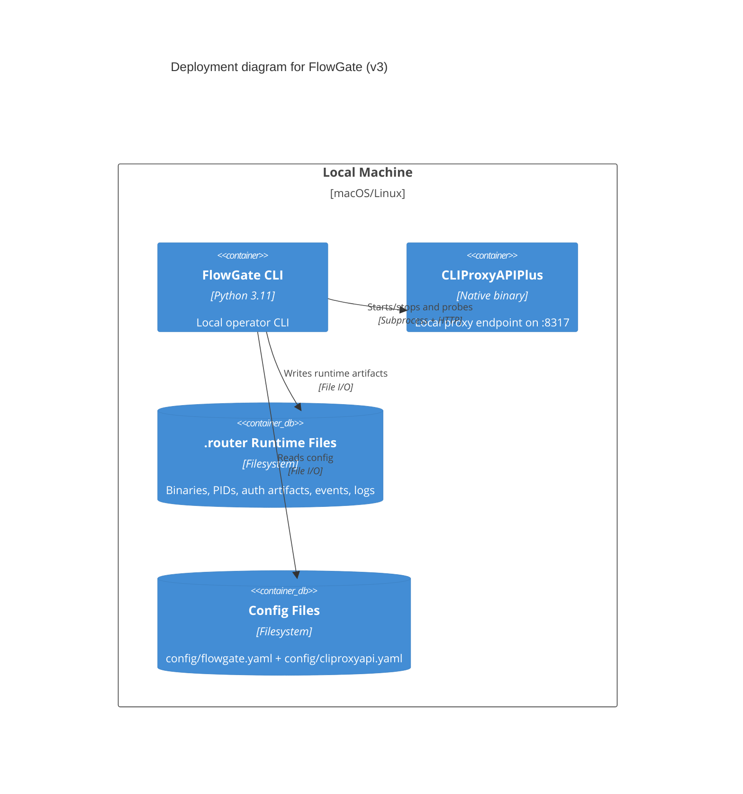

# C4 Level 4: Deployment Diagram (v3)

```mermaid
C4Deployment
  title Deployment diagram for FlowGate (v3)

  Deployment_Node(localMachine, "Local Machine", "macOS/Linux") {
    Container(flowgateCli, "FlowGate CLI", "Python 3.11", "Local operator CLI")
    Container(cliproxySvc, "CLIProxyAPIPlus", "Native binary", "Local proxy endpoint on :8317")
    ContainerDb(runtimeFiles, ".router Runtime Files", "Filesystem", "Binaries, PIDs, auth artifacts, events, logs")
    ContainerDb(configFiles, "Config Files", "Filesystem", "config/flowgate.yaml + config/cliproxyapi.yaml")
  }

  Rel(flowgateCli, configFiles, "Reads config", "File I/O")
  Rel(flowgateCli, runtimeFiles, "Writes runtime artifacts", "File I/O")
  Rel(flowgateCli, cliproxySvc, "Starts/stops and probes", "Subprocess + HTTP")
```

