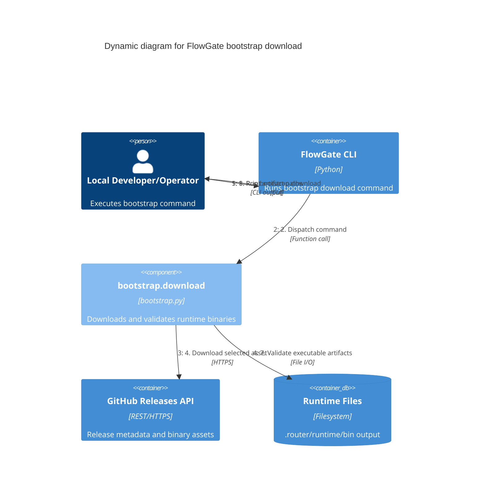

# C4 Dynamic Diagram: Bootstrap Download Flow

This diagram captures the `flowgate bootstrap download` runtime artifact setup path.

```mermaid
C4Dynamic
  title Dynamic diagram for FlowGate bootstrap download

  Person(operator, "Local Developer/Operator", "Executes bootstrap command")
  Container(flowgateCli, "FlowGate CLI", "Python", "Runs bootstrap download command")
  Component(bootstrapMgr, "bootstrap.download", "bootstrap.py", "Downloads and validates runtime binaries")
  Container(githubApi, "GitHub Releases API", "REST/HTTPS", "Release metadata and binary assets")
  ContainerDb(runtimeFiles, "Runtime Files", "Filesystem", ".router/runtime/bin output")

  Rel(operator, flowgateCli, "1. Run bootstrap download", "CLI")
  Rel(flowgateCli, bootstrapMgr, "2. Dispatch command", "Function call")
  Rel(bootstrapMgr, githubApi, "3. Query release metadata", "HTTPS")
  Rel(bootstrapMgr, githubApi, "4. Download selected asset", "HTTPS")
  Rel(bootstrapMgr, runtimeFiles, "5. Write CLIProxyAPIPlus binary", "File I/O")
  Rel(bootstrapMgr, runtimeFiles, "6. Generate litellm runner script", "File I/O")
  Rel(bootstrapMgr, runtimeFiles, "7. Validate executable artifacts", "File I/O")
  Rel(flowgateCli, operator, "8. Print artifact paths", "CLI output")
```
