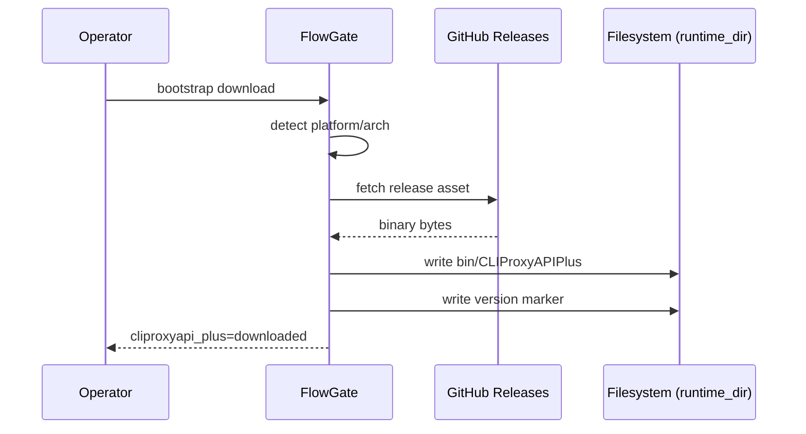

# C4 Dynamic: Bootstrap Download (v3)

```mermaid
sequenceDiagram
  participant U as Operator
  participant F as FlowGate
  participant GH as GitHub Releases
  participant FS as Filesystem (runtime_dir)

  U->>F: bootstrap download
  F->>F: detect platform/arch
  F->>GH: fetch release asset
  GH-->>F: binary bytes
  F->>FS: write bin/CLIProxyAPIPlus
  F->>FS: write version marker
  F-->>U: cliproxyapi_plus=downloaded
```

