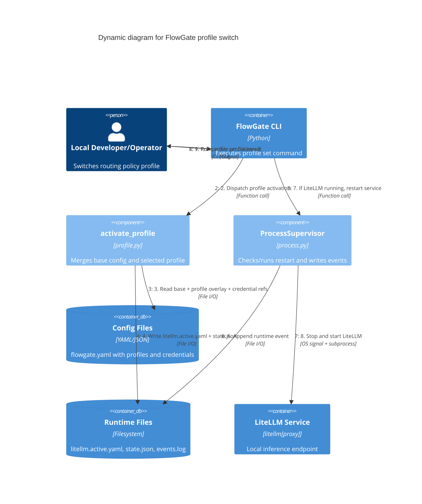

# C4 Dynamic Diagram: Profile Switch Flow

This diagram captures `flowgate profile set <name>` including conditional LiteLLM restart.

```mermaid
C4Dynamic
  title Dynamic diagram for FlowGate profile switch

  Person(operator, "Local Developer/Operator", "Switches routing policy profile")
  Container(flowgateCli, "FlowGate CLI", "Python", "Executes profile set command")
  Component(profileEngine, "activate_profile", "profile.py", "Merges base config and selected profile")
  Component(supervisor, "ProcessSupervisor", "process.py", "Checks/runs restart and writes events")
  ContainerDb(configFiles, "Config Files", "YAML/JSON", "flowgate.yaml with profiles and credentials")
  ContainerDb(runtimeFiles, "Runtime Files", "Filesystem", "litellm.active.yaml, state.json, events.log")
  Container(litellmSvc, "LiteLLM Service", "litellm[proxy]", "Local inference endpoint")

  Rel(operator, flowgateCli, "1. Run profile set balanced", "CLI")
  Rel(flowgateCli, profileEngine, "2. Dispatch profile activation", "Function call")
  Rel(profileEngine, configFiles, "3. Read base + profile overlay + credential refs", "File I/O")
  Rel(profileEngine, runtimeFiles, "4. Write litellm.active.yaml + state.json", "File I/O")
  Rel(flowgateCli, supervisor, "5. Record profile_switch event", "Function call")
  Rel(supervisor, runtimeFiles, "6. Append runtime event", "File I/O")
  Rel(flowgateCli, supervisor, "7. If LiteLLM running, restart service", "Function call")
  Rel(supervisor, litellmSvc, "8. Stop and start LiteLLM", "OS signal + subprocess")
  Rel(flowgateCli, operator, "9. Print active profile/result", "CLI output")
```
