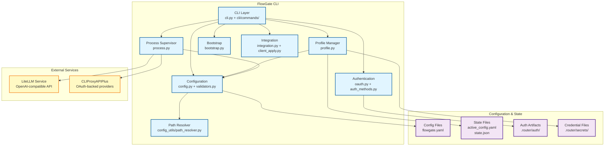
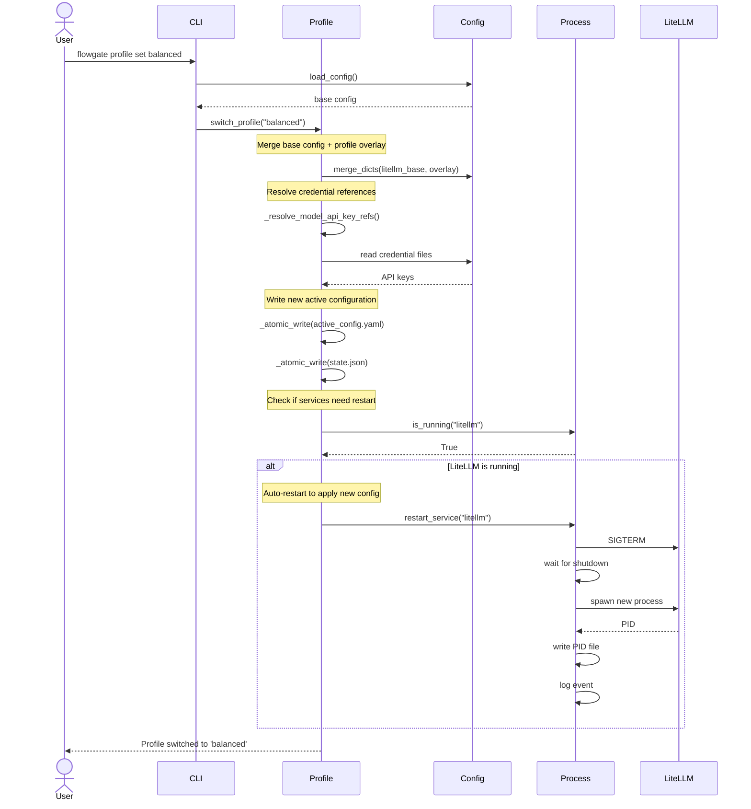
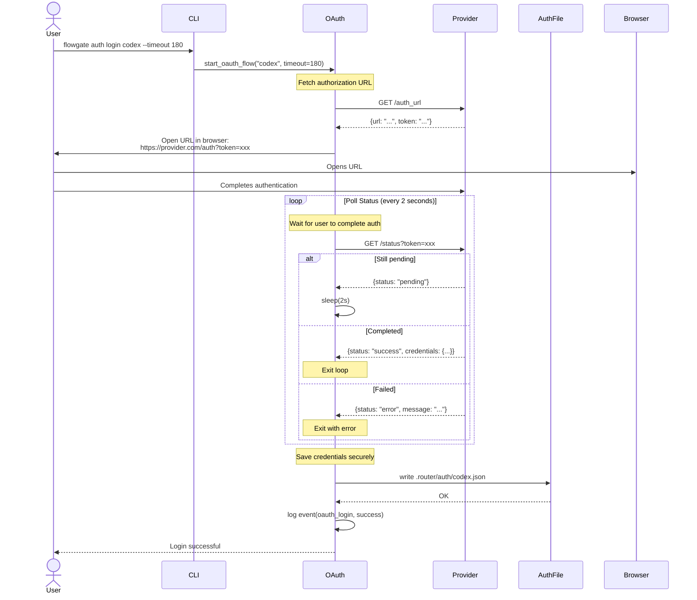
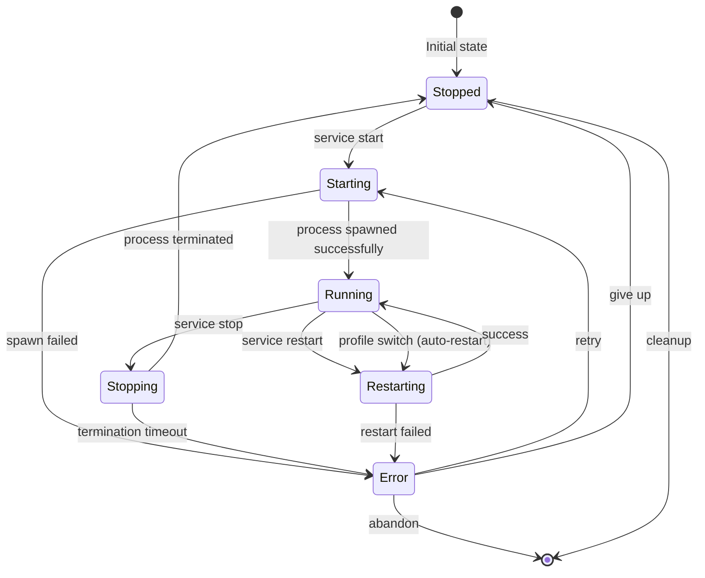

# FlowGate Architecture Diagrams

This document provides visual representations of FlowGate's system architecture and key operational flows.

## Table of Contents

1. [Component Diagram](#component-diagram) - System components and their relationships
2. [Profile Switch Flow](#profile-switch-flow) - Sequence diagram for profile switching
3. [OAuth Login Flow](#oauth-login-flow) - Sequence diagram for authentication
4. [Service Lifecycle](#service-lifecycle) - State diagram for service management

---

## Component Diagram

This diagram shows the main architectural components of FlowGate and their relationships.



### Component Descriptions

**CLI Layer** (`src/flowgate/cli/`):
- Entry point for all user commands
- Argument parsing and command routing
- Uses BaseCommand pattern with @handle_command_errors decorator
- Delegates to specialized modules for implementation

**Configuration** (`src/flowgate/config.py`, `validators.py`):
- Loads and validates configuration schema (version 2)
- Normalizes legacy config formats
- Validates required keys and service definitions
- Provides configuration access to other components

**Path Resolver** (`src/flowgate/config_utils/path_resolver.py`):
- Unified path resolution for all configuration paths
- Handles absolute paths (unchanged) and relative paths (relative to config dir)
- Deep-copies configuration to prevent mutations
- Resolves 4 path types: paths.*, secret_files, credentials, service cwd

**Process Supervisor** (`src/flowgate/process.py`):
- Manages service lifecycle (start/stop/restart)
- PID-based process tracking under `.router/runtime/pids/`
- Port conflict detection and validation
- JSON event logging to `.router/runtime/events.log`

**Authentication** (`src/flowgate/oauth.py`, `auth_methods.py`):
- OAuth polling flow for browser-based authentication
- Headless import for device-auth flows
- Extensible handler registry for multiple providers (Codex, GitHub Copilot)
- Stores auth artifacts in `.router/auth/`

**Profile Manager** (`src/flowgate/profile.py`):
- Merges `litellm_base` with profile-specific overlays
- Resolves `api_key_ref` from credential files
- Atomically writes active config and state files
- Automatic LiteLLM restart when switching profiles while service is running

**Bootstrap** (`src/flowgate/bootstrap.py`):
- Downloads platform-specific CLIProxyAPIPlus binaries from GitHub releases
- Generates LiteLLM runner script (wraps `uv run litellm`)
- Platform detection for darwin/linux and amd64/arm64

**Integration** (`src/flowgate/integration.py`, `client_apply.py`):
- Generates client config snippets (Codex, Claude Code)
- Applies settings to client config files with automatic backup
- Supports multiple client integrations

---

## Profile Switch Flow

This sequence diagram shows what happens when a user switches between policy profiles (e.g., reliability, balanced, cost).



### Key Steps

1. **Load Configuration**: CLI loads the base configuration from `flowgate.yaml`
2. **Merge Overlay**: Profile manager merges `litellm_base` with profile-specific settings
3. **Resolve Credentials**: Replaces `api_key_ref` placeholders with actual API keys from credential files
4. **Write Active Config**: Atomically writes merged configuration to `active_config.yaml`
5. **Update State**: Records current profile in `state.json`
6. **Auto-Restart**: If LiteLLM service is running, automatically restarts it to apply new settings
7. **Event Logging**: Records profile switch event in `events.log`

---

## OAuth Login Flow

This sequence diagram illustrates the OAuth polling flow used for authenticating with providers like Codex and GitHub Copilot.



### Key Steps

1. **Fetch Auth URL**: Request authorization URL from provider's `/auth_url` endpoint
2. **User Authorization**: Open browser to authorization URL, user completes authentication
3. **Status Polling**: Continuously poll `/status` endpoint every 2 seconds
4. **Credential Storage**: Upon success, write auth artifact to `.router/auth/<provider>.json`
5. **Event Logging**: Record authentication event in `events.log`
6. **Error Handling**: Handle timeout, network errors, and user-denied scenarios

### Alternative: Headless Import

For headless environments or when credentials already exist (e.g., from Codex CLI), FlowGate supports importing existing auth artifacts:

```bash
flowgate auth import-headless codex --source ~/.codex/auth.json
```

This bypasses the browser OAuth flow and directly copies the authentication artifact.

---

## Service Lifecycle

This state diagram shows the lifecycle of managed services (LiteLLM and CLIProxyAPIPlus).



### State Descriptions

**Stopped**: Service is not running, no PID file exists or PID is stale.

**Starting**: Process is being spawned:
- Command arguments prepared
- Environment variables set
- Subprocess spawned
- PID recorded to `.router/runtime/pids/<service>.pid`
- Event logged

**Running**: Service is active:
- PID file exists and process is alive (`os.kill(pid, 0)` succeeds)
- Service is listening on configured port
- Accessible via health check endpoint

**Stopping**: Service is being terminated:
- SIGTERM sent to process
- Wait for graceful shutdown (up to 10 seconds)
- If not stopped, SIGKILL sent
- PID file removed

**Restarting**: Service is being restarted (stop + start):
- Triggered explicitly by `service restart` command
- Triggered automatically when switching profiles while service is running
- Ensures zero-downtime configuration reload

**Error**: Service operation failed:
- Spawn failure (binary not found, port conflict, permission denied)
- Termination timeout
- Health check failure
- Can retry or abandon based on context

### Process Management Details

**PID Tracking**: Each service stores its PID in `.router/runtime/pids/<service>.pid`

**Port Validation**: Before starting, check if configured port is available using socket binding test

**Health Checks**: After startup, verify service responds to health endpoint (if configured)

**Event Logging**: All state transitions are logged to `.router/runtime/events.log` with timestamps

**Cleanup**: On stop, PID files are removed, orphaned processes are killed

---

## Related Documentation

- [C4 Architecture Diagrams](README.md) - Comprehensive C4 model diagrams
- [Data Flows](data-flows.md) - Detailed data flow documentation
- [Component Details](c4-components-cli.md) - In-depth component architecture
- [Dynamic Flows](c4-dynamic-profile-switch.md) - Profile switch implementation details

---

**Last Updated**: 2026-02-19
