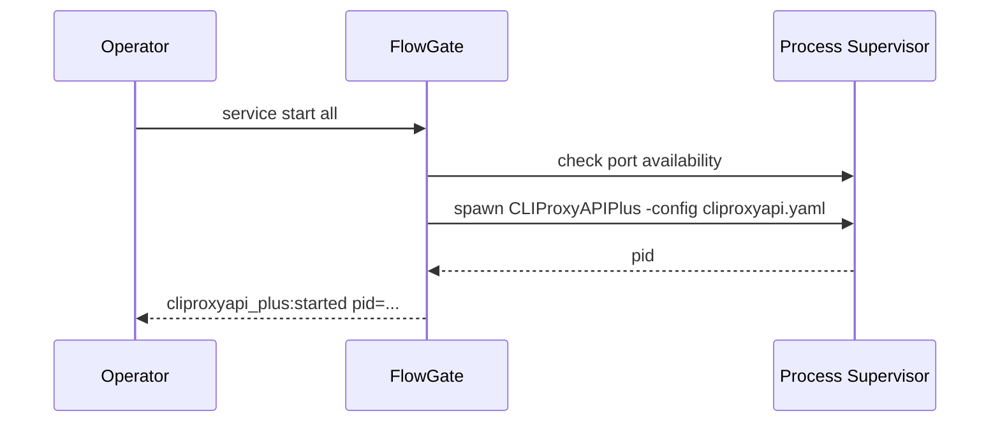

# Architecture Diagrams (v3, cliproxy-only)

FlowGate v3 manages a single local service: **CLIProxyAPIPlus**.

## Container View

```mermaid
flowchart LR
  Operator[Developer/Operator]
  FlowGate[FlowGate CLI]
  CLIProxy[CLIProxyAPIPlus\nOpenAI-compatible endpoint]
  Clients[Clients\n(Codex, Claude Code, etc.)]
  GitHub[GitHub Releases]
  OAuth[OAuth Providers]
  Upstream[Upstream LLM APIs]

  Operator -->|CLI| FlowGate
  FlowGate -->|download binary| GitHub
  FlowGate -->|start/stop/health| CLIProxy
  FlowGate -->|oauth auth-url/status| CLIProxy
  Clients -->|HTTP /v1| CLIProxy
  CLIProxy -->|OAuth| OAuth
  CLIProxy -->|HTTPS| Upstream
```

## Service Start Sequence

```mermaid
sequenceDiagram
  participant U as Operator
  participant F as FlowGate
  participant P as Process Supervisor

  U->>F: service start all
  F->>P: check port availability
  F->>P: spawn CLIProxyAPIPlus -config cliproxyapi.yaml
  P-->>F: pid
  F-->>U: cliproxyapi_plus:started pid=...
```

