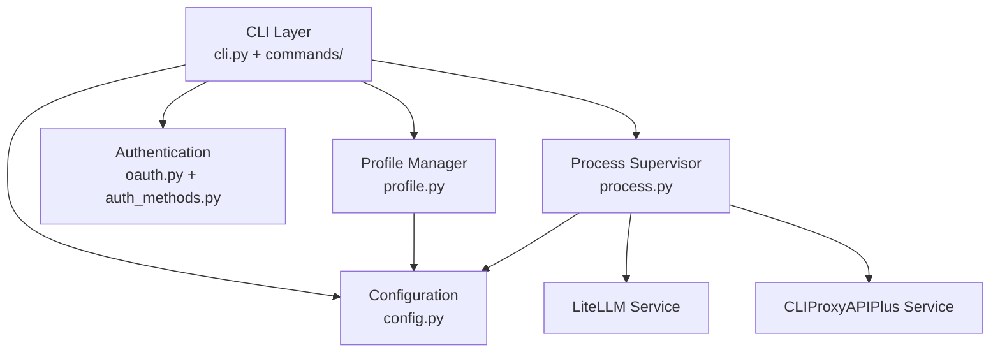
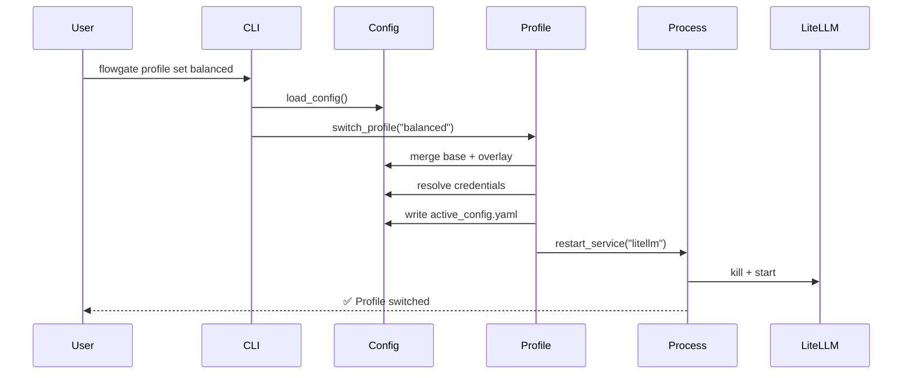

# FlowGate 项目优化计划

**生成日期**: 2026-02-18
**当前版本**: v0.1.x (config_version: 2)
**优化目标**: 提升代码质量、降低维护成本、增强可扩展性

---

## 执行摘要

基于对代码库的全面分析,FlowGate 项目整体质量良好,但存在以下核心问题:

1. **cli.py 过度臃肿** (1021 行),单文件承担过多职责
2. **配置系统复杂度过高**,向后兼容性维护成本大
3. **代码重复**,异常处理和验证逻辑散布各处
4. **测试覆盖不完整**,缺少错误路径和边界条件测试
5. **文档碎片化**,多处重复且缺失关键文档

优化计划分为 **4 个阶段**,预计耗时 2-3 周,优先处理高价值/低风险的重构项。

---

## 优先级说明

- **P0 (紧急)**: 影响稳定性或安全性,必须立即处理
- **P1 (高)**: 显著提升代码质量,降低维护成本
- **P2 (中)**: 改善开发体验,增强可扩展性
- **P3 (低)**: 锦上添花,可延后处理

---

## 阶段 1: 代码结构重构 (P1)

### 1.1 拆分 cli.py 模块

**问题描述**:
- `cli.py` 1021 行,包含 CLI 解析、命令处理、异常处理、配置加载等多个职责
- 命令处理函数 (`_cmd_auth_*`, `_cmd_service_*` 等) 存在重复结构
- 难以测试和维护

**优化方案**:
```
src/flowgate/
├── cli/
│   ├── __init__.py         # 导出 main() 入口
│   ├── parser.py           # argparse 解析逻辑
│   ├── commands/           # 命令处理器
│   │   ├── __init__.py
│   │   ├── base.py         # BaseCommand 基类
│   │   ├── auth.py         # auth 子命令
│   │   ├── service.py      # service 子命令
│   │   ├── profile.py      # profile 子命令
│   │   ├── health.py       # status/health/doctor
│   │   ├── bootstrap.py    # bootstrap 命令
│   │   └── integration.py  # integration 命令
│   └── utils.py            # CLI 通用工具 (load_config_or_exit)
```

**重构步骤**:
1. 创建 `BaseCommand` 抽象类,统一命令接口:
   ```python
   class BaseCommand:
       def __init__(self, args: Namespace, config: dict):
           self.args = args
           self.config = config

       def execute(self) -> int:
           """返回退出码: 0=成功, 非0=失败"""
           raise NotImplementedError
   ```

2. 提取命令处理逻辑到独立类:
   ```python
   # cli/commands/auth.py
   class AuthLoginCommand(BaseCommand):
       def execute(self) -> int:
           try:
               # 原 _cmd_auth_login 逻辑
           except ConfigError as e:
               print(f"配置错误: {e}", file=sys.stderr)
               return 1
   ```

3. 重构 `main()` 函数使用命令路由:
   ```python
   COMMAND_MAP = {
       ("auth", "login"): AuthLoginCommand,
       ("service", "start"): ServiceStartCommand,
       # ...
   }

   def main(argv=None):
       args = build_parser().parse_args(argv)
       config = load_config_or_exit(args.config)

       key = (args.command, getattr(args, 'subcommand', None))
       command_class = COMMAND_MAP.get(key)
       if command_class:
           return command_class(args, config).execute()
       # ...
   ```

**影响范围**:
- 修改文件: `cli.py` → 拆分为 9 个文件
- 测试更新: `test_cli.py` 需相应拆分
- 向后兼容: CLI 接口不变,用户无感知

**验证标准**:
- [ ] 所有现有测试通过
- [ ] `cli.py` 缩减至 < 300 行
- [ ] 每个命令类 < 100 行
- [ ] 代码重复率下降 > 30%

---

### 1.2 统一异常处理和日志记录

**问题描述**:
- 大量 `except Exception as exc: # noqa: BLE001` 过度宽泛的异常捕获
- 错误输出不一致 (stderr vs 日志文件)
- 缺少调试信息和堆栈跟踪

**优化方案**:
创建统一的异常处理装饰器和日志工具:

```python
# src/flowgate/cli/error_handler.py
import functools
import logging
from typing import Callable

logger = logging.getLogger(__name__)

def handle_command_errors(func: Callable) -> Callable:
    """统一命令异常处理装饰器"""
    @functools.wraps(func)
    def wrapper(*args, **kwargs) -> int:
        try:
            return func(*args, **kwargs)
        except ConfigError as e:
            logger.error(f"配置错误: {e}")
            print(f"❌ 配置错误: {e}", file=sys.stderr)
            return 1
        except ProcessError as e:
            logger.error(f"进程错误: {e}", exc_info=True)
            print(f"❌ 进程操作失败: {e}", file=sys.stderr)
            return 2
        except Exception as e:
            logger.exception(f"未预期错误: {e}")
            print(f"❌ 内部错误: {e}\n请使用 --debug 查看详细信息", file=sys.stderr)
            return 99
    return wrapper

# 使用方式:
class AuthLoginCommand(BaseCommand):
    @handle_command_errors
    def execute(self) -> int:
        # 命令逻辑,无需 try/except
        return 0
```

**退出码规范**:
- `0`: 成功
- `1`: 配置错误 (用户可修复)
- `2`: 运行时错误 (如进程已运行、端口占用)
- `3`: 权限错误
- `99`: 未预期的内部错误

**影响范围**:
- 新增文件: `cli/error_handler.py`
- 修改文件: 所有命令类
- 测试更新: 验证退出码和错误消息

---

### 1.3 提取配置验证逻辑

**问题描述**:
- 配置验证散布在 `config.py` 和 `cli.py` 中
- 重复的 `isinstance` 和字段检查

**优化方案**:
使用 `pydantic` 或自定义验证器类:

```python
# src/flowgate/config/validators.py
from typing import Any

class ConfigValidator:
    @staticmethod
    def validate_service(service_name: str, service_config: dict) -> None:
        """验证服务配置"""
        required = ["command", "host", "port"]
        for key in required:
            if key not in service_config:
                raise ConfigError(f"服务 '{service_name}' 缺少必需字段: {key}")

        if not isinstance(service_config["port"], int):
            raise ConfigError(f"服务 '{service_name}' 的端口必须是整数")

        if not (1024 <= service_config["port"] <= 65535):
            raise ConfigError(f"服务 '{service_name}' 的端口必须在 1024-65535 之间")

    @staticmethod
    def validate_litellm_base(config: dict) -> None:
        """验证 LiteLLM 基础配置"""
        # ...
```

**影响范围**:
- 新增文件: `config/validators.py`
- 修改文件: `config.py`
- 代码减少: 约 100 行重复验证逻辑

---

## 阶段 2: 配置系统简化 (P1)

### 2.1 移除 config_version: 1 支持

**问题描述**:
- 同时支持版本 1 和 2 增加了代码复杂度
- 字段别名处理 (`oauth` → `auth.providers`) 维护成本高
- 用户已迁移到版本 2 (根据 CLAUDE.md)

**优化方案**:
1. **弃用通知** (v0.2.0):
   - 启动时检测 `config_version: 1`,输出警告:
     ```
     ⚠️  警告: config_version 1 已弃用,将在 v0.3.0 中移除
     请运行: flowgate config migrate --to-version 2
     ```
   - 添加 `config migrate` 命令自动转换配置

2. **完全移除** (v0.3.0):
   - 删除 `_normalize_config()` 中的版本 1 处理逻辑
   - 删除字段别名映射 (`oauth`, `secrets`, `cliproxyapi`)
   - 更新文档和示例配置

**配置迁移工具**:
```python
# cli/commands/config.py
class ConfigMigrateCommand(BaseCommand):
    def execute(self) -> int:
        """迁移配置文件到最新版本"""
        old_config = load_config(self.args.config)
        new_config = migrate_to_v2(old_config)

        # 备份原配置
        backup_path = f"{self.args.config}.backup-{timestamp()}"
        shutil.copy(self.args.config, backup_path)

        # 写入新配置
        write_config(self.args.config, new_config)
        print(f"✅ 配置已迁移到版本 2")
        print(f"📦 原配置已备份至: {backup_path}")
        return 0
```

**影响范围**:
- 修改文件: `config.py` (移除约 150 行向后兼容代码)
- 新增命令: `flowgate config migrate`
- 破坏性变更: 需在 v0.3.0 发布说明中明确标注

**验证标准**:
- [ ] 迁移命令正确转换所有配置字段
- [ ] 版本 2 配置加载时间减少 > 20%
- [ ] 所有测试使用版本 2 配置

---

### 2.2 简化路径解析逻辑

**问题描述**:
- `_resolve_config_paths()` 函数处理 4 种路径类型,逻辑复杂
- 路径解析依赖关系混乱 (相对路径基准不一致)

**优化方案**:
创建 `PathResolver` 类统一处理:

```python
# src/flowgate/config/path_resolver.py
from pathlib import Path

class PathResolver:
    def __init__(self, config_path: Path):
        self.config_dir = config_path.parent.resolve()

    def resolve(self, path_str: str, base_dir: Path = None) -> Path:
        """
        解析路径,支持绝对路径和相对路径

        相对路径解析规则:
        1. 默认相对于配置文件目录
        2. 如果指定 base_dir,则相对于 base_dir
        """
        path = Path(path_str)
        if path.is_absolute():
            return path

        base = base_dir or self.config_dir
        return (base / path).resolve()

    def resolve_config_paths(self, config: dict) -> dict:
        """递归解析配置中的所有路径字段"""
        resolved = config.copy()

        # 解析顶级路径
        for key in ["runtime_dir", "active_config", "state_file", "log_file"]:
            if key in config["paths"]:
                resolved["paths"][key] = str(self.resolve(config["paths"][key]))

        # 解析凭证文件路径
        runtime_dir = Path(resolved["paths"]["runtime_dir"])
        for name, cred in config.get("credentials", {}).get("upstream", {}).items():
            if "file" in cred:
                resolved["credentials"]["upstream"][name]["file"] = str(
                    self.resolve(cred["file"], base_dir=runtime_dir)
                )

        return resolved
```

**影响范围**:
- 新增文件: `config/path_resolver.py`
- 修改文件: `config.py` (简化 100+ 行路径处理代码)
- 测试更新: 新增 `test_path_resolver.py`

---

## 阶段 3: 测试增强 (P2)

### 3.1 增加错误路径测试

**问题描述**:
- 大量异常处理分支未覆盖
- 缺少边界条件测试 (如端口冲突、权限拒绝等)

**优化方案**:
为每个模块添加专门的错误测试类:

```python
# tests/test_config_errors.py
class TestConfigErrorHandling(unittest.TestCase):
    """配置模块错误处理测试"""

    def test_missing_required_key(self):
        """测试缺少必需字段时抛出 ConfigError"""
        invalid_config = {"paths": {}, "services": {}}  # 缺少 litellm_base
        with self.assertRaises(ConfigError) as ctx:
            validate_config(invalid_config)
        self.assertIn("litellm_base", str(ctx.exception))

    def test_invalid_port_type(self):
        """测试端口类型错误"""
        config = self._base_config()
        config["services"]["litellm"]["port"] = "not_a_number"
        with self.assertRaises(ConfigError) as ctx:
            validate_config(config)
        self.assertIn("port", str(ctx.exception).lower())

    def test_nonexistent_credential_file(self):
        """测试凭证文件不存在"""
        config = self._base_config()
        config["credentials"]["upstream"]["test"] = {
            "file": "/nonexistent/path/to/key.txt"
        }
        issues = find_upstream_credential_issues(config)
        self.assertTrue(any("not found" in issue for issue in issues))
```

**目标覆盖率**:
- 语句覆盖率: > 90%
- 分支覆盖率: > 80%
- 错误路径覆盖: 所有 `raise` 语句都有对应测试

---

### 3.2 重构测试数据管理

**问题描述**:
- `test_cli.py` 包含 77 行硬编码配置
- 测试配置重复,难以维护

**优化方案**:
创建测试数据工厂:

```python
# tests/fixtures/config_factory.py
from typing import Dict, Any

class ConfigFactory:
    @staticmethod
    def minimal() -> Dict[str, Any]:
        """最小可用配置"""
        return {
            "config_version": 2,
            "paths": {
                "runtime_dir": ".router",
                "active_config": ".router/runtime/active_config.yaml",
                # ...
            },
            "services": {
                "litellm": ConfigFactory.service("litellm", 4000),
                "cliproxyapi_plus": ConfigFactory.service("cliproxyapi", 5000),
            },
            "litellm_base": ConfigFactory.litellm_base_minimal(),
            "profiles": {"default": {}},
        }

    @staticmethod
    def with_auth(providers: list[str]) -> Dict[str, Any]:
        """包含认证配置的配置"""
        config = ConfigFactory.minimal()
        config["auth"] = {"providers": {}}
        for provider in providers:
            config["auth"]["providers"][provider] = ConfigFactory.auth_provider(provider)
        return config

    @staticmethod
    def service(name: str, port: int) -> Dict[str, Any]:
        return {
            "command": {"args": [f"/path/to/{name}"]},
            "host": "127.0.0.1",
            "port": port,
        }
    # ...

# 测试中使用:
class TestAuthLogin(unittest.TestCase):
    def test_login_codex(self):
        config = ConfigFactory.with_auth(["codex"])
        # 测试逻辑...
```

**影响范围**:
- 新增文件: `tests/fixtures/config_factory.py`
- 修改文件: 所有测试文件 (使用工厂替代硬编码)
- 代码减少: 约 300 行重复测试配置

---

### 3.3 添加集成测试套件

**问题描述**:
- CI 中排除了 OAuth 流程测试
- 缺少端到端的服务启动/停止测试

**优化方案**:
创建可选的集成测试套件 (需要真实环境):

```bash
# 本地运行集成测试
./scripts/integration_test.sh --profile balanced

# CI 中跳过集成测试 (默认)
uv run pytest tests/unit/  # 仅运行单元测试
```

**集成测试场景**:
1. 完整的 profile 切换流程 (已存在于 `test_integration_profile_switch.py`)
2. 服务启动 → 健康检查 → 停止流程
3. OAuth 登录流程 (模拟服务器)
4. 并发操作测试 (同时切换 profile 和重启服务)

---

## 阶段 4: 文档和工程优化 (P2-P3)

### 4.1 统一文档管理

**问题描述**:
- 文档分布在 README.md, CLAUDE.md, docs/ 三处
- 部分文档缺失 (`docs/release-and-rollback.md`)
- 信息重复,维护困难

**优化方案**:
重组文档结构:

```
docs/
├── README.md               # 快速开始 (从根 README.md 移动)
├── architecture.md         # 架构设计和模块说明
├── configuration.md        # 配置参考手册
├── development.md          # 开发指南 (从 CLAUDE.md 移动)
├── api/                    # API 文档
│   ├── cli.md              # CLI 命令参考
│   └── python-api.md       # Python API (如果提供库模式)
├── guides/                 # 操作指南
│   ├── profile-management.md
│   ├── oauth-setup.md
│   └── troubleshooting.md  # 从 runbook 移动
└── plans/                  # 项目计划 (本文档所在)
    └── optimization-plan.md

# 根目录保留精简的 README.md (< 100 行)
README.md                   # 项目简介 + 安装 + 快速开始
CLAUDE.md                   # → 符号链接到 docs/development.md
```

**文档更新原则**:
1. **单一来源 (Single Source of Truth)**: 每条信息只在一个文件中维护
2. **分层文档**: 根据受众分为用户文档和开发者文档
3. **及时更新**: 代码变更时同步更新相关文档

---

### 4.2 依赖管理优化

**问题描述**:
- LiteLLM 版本固定为 1.75.8,可能存在安全漏洞
- Python 版本限制过于严格 (3.12-3.13.14)

**优化方案**:
1. **放宽 LiteLLM 版本约束**:
   ```toml
   [project]
   dependencies = [
       "litellm[proxy]>=1.75.8,<2.0.0",  # 允许次版本更新
   ]
   ```

2. **扩展 Python 版本支持**:
   ```toml
   requires-python = ">=3.11"  # 支持 Python 3.11+
   ```

3. **添加依赖更新检查**:
   ```bash
   # scripts/check_dependencies.sh
   uv pip list --outdated
   uv pip audit  # 安全漏洞检查
   ```

**影响范围**:
- 修改文件: `pyproject.toml`
- 测试需求: 在 Python 3.11/3.12/3.13 上运行 CI
- 风险: 可能出现 LiteLLM 新版本的兼容性问题

---

### 4.3 添加架构图和 API 文档

**问题描述**:
- 缺少可视化架构图
- 新开发者难以快速理解项目结构

**优化方案**:
使用 Mermaid 创建架构图:

```markdown
<!-- docs/architecture.md -->

## 系统架构

### 组件视图


### 数据流:Profile 切换

```

**文档生成工具**:
- 使用 `pdoc` 或 `sphinx` 生成 Python API 文档
- 集成到 CI 中自动发布到 GitHub Pages

---

## 阶段 5: 性能和可观测性增强 (P3)

### 5.1 添加性能指标日志

**问题描述**:
- 缺少启动时间、响应时间等性能指标
- 难以识别性能瓶颈

**优化方案**:
在关键路径添加性能日志:

```python
# src/flowgate/observability.py
import time
import functools

def measure_time(operation: str):
    """性能测量装饰器"""
    def decorator(func):
        @functools.wraps(func)
        def wrapper(*args, **kwargs):
            start = time.perf_counter()
            result = func(*args, **kwargs)
            duration_ms = (time.perf_counter() - start) * 1000

            log_event({
                "event": "performance_metric",
                "operation": operation,
                "duration_ms": round(duration_ms, 2),
                "timestamp": timestamp_utc(),
            })
            return result
        return wrapper
    return decorator

# 使用:
@measure_time("profile_switch")
def switch_profile(profile_name: str, config: dict) -> None:
    # ...
```

**监控指标**:
- 配置加载时间
- Profile 切换时间
- 服务启动/停止时间
- OAuth 认证耗时

---

### 5.2 健康检查增强

**问题描述**:
- 当前健康检查仅验证 HTTP 响应码
- 缺少依赖检查 (如 CLIProxyAPI 是否可达)

**优化方案**:
扩展 `health.py` 功能:

```python
# src/flowgate/health.py
def comprehensive_health_check(config: dict) -> Dict[str, Any]:
    """全面健康检查"""
    return {
        "services": {
            "litellm": check_litellm_health(config),
            "cliproxyapi_plus": check_cliproxyapi_health(config),
        },
        "dependencies": {
            "upstream_api": check_upstream_api(config),  # 检查上游 API 可用性
        },
        "resources": {
            "disk_space": check_disk_space(config["paths"]["runtime_dir"]),
            "memory": check_memory_usage(),
        },
        "configuration": {
            "credentials_valid": validate_credentials(config),
            "ports_available": check_port_conflicts(config),
        },
    }
```

输出格式:
```bash
$ flowgate health --verbose
✅ LiteLLM: Healthy (http://127.0.0.1:4000)
✅ CLIProxyAPIPlus: Healthy (http://127.0.0.1:5000)
✅ Upstream API: Reachable
⚠️  Disk Space: 15% free (警告: < 20%)
✅ Memory: 2.3GB / 16GB
✅ Credentials: Valid (expires in 7 days)
✅ Ports: No conflicts

Overall Status: DEGRADED (1 warning)
```

---

## 实施计划

### 时间线 (建议)

| 阶段 | 任务 | 预计耗时 | 优先级 | 风险等级 |
|------|------|---------|--------|---------|
| **1** | 拆分 cli.py 模块 | 3-4 天 | P1 | 中 (需要大量测试) |
| **1** | 统一异常处理 | 1-2 天 | P1 | 低 |
| **1** | 提取配置验证 | 1 天 | P1 | 低 |
| **2** | 移除 config v1 支持 | 2 天 | P1 | 高 (破坏性变更) |
| **2** | 简化路径解析 | 1-2 天 | P1 | 中 |
| **3** | 增加错误路径测试 | 2-3 天 | P2 | 低 |
| **3** | 重构测试数据 | 1 天 | P2 | 低 |
| **3** | 集成测试套件 | 2 天 | P2 | 低 |
| **4** | 统一文档管理 | 1-2 天 | P2 | 低 |
| **4** | 依赖管理优化 | 0.5 天 | P3 | 中 (兼容性风险) |
| **4** | 添加架构图 | 1 天 | P3 | 低 |
| **5** | 性能指标日志 | 1 天 | P3 | 低 |
| **5** | 健康检查增强 | 1-2 天 | P3 | 低 |

**总计**: 18-23 天 (约 3-4 周)

---

### 版本规划

**v0.2.0** (短期,2-3 周):
- ✅ 拆分 cli.py 模块 (阶段 1.1)
- ✅ 统一异常处理 (阶段 1.2)
- ✅ 提取配置验证 (阶段 1.3)
- ✅ 增加错误路径测试 (阶段 3.1)
- ⚠️  弃用 config_version: 1 (警告,不移除)

**v0.3.0** (中期,1-2 个月):
- ✅ 完全移除 config v1 支持 (阶段 2.1) 【破坏性变更】
- ✅ 简化路径解析 (阶段 2.2)
- ✅ 重构测试数据 (阶段 3.2)
- ✅ 统一文档管理 (阶段 4.1)

**v0.4.0** (长期,2-3 个月):
- ✅ 集成测试套件 (阶段 3.3)
- ✅ 依赖管理优化 (阶段 4.2)
- ✅ 架构图和 API 文档 (阶段 4.3)
- ✅ 性能和可观测性增强 (阶段 5)

---

## 风险评估和缓解措施

### 高风险项

**1. 移除 config_version: 1 支持 (阶段 2.1)**
- **风险**: 破坏现有用户配置
- **缓解**:
  - 提前一个版本发出弃用警告
  - 提供自动迁移命令
  - 详细的迁移文档和示例
  - 在发布说明中明确标注破坏性变更

**2. 拆分 cli.py 模块 (阶段 1.1)**
- **风险**: 引入回归 bug,破坏现有功能
- **缓解**:
  - 每次重构后运行完整测试套件
  - 先拆分,再优化 (避免同时改变结构和逻辑)
  - 保留原有测试用例,确保行为一致
  - 分模块逐步拆分,每次拆分后验证

### 中等风险项

**3. 依赖版本放宽 (阶段 4.2)**
- **风险**: LiteLLM 新版本可能引入不兼容变更
- **缓解**:
  - 设置版本上限 (`<2.0.0`)
  - 在 CI 中测试多个 LiteLLM 版本
  - 锁定 `uv.lock` 确保可重现构建

**4. 简化路径解析 (阶段 2.2)**
- **风险**: 路径解析行为变更导致文件找不到
- **缓解**:
  - 完善路径解析测试 (绝对路径、相对路径、边界条件)
  - 在开发环境和 CI 中测试不同的配置文件位置

---

## 成功标准

### 代码质量指标
- [ ] `cli.py` 文件行数 < 300 行 (当前 1021 行)
- [ ] 代码重复率 < 5% (通过 pylint 检测)
- [ ] 单元测试覆盖率 > 90%
- [ ] 所有模块的圈复杂度 < 10

### 性能指标
- [ ] 配置加载时间 < 100ms (当前未测量)
- [ ] Profile 切换时间 < 2s (当前未测量)
- [ ] 服务启动时间无明显增加

### 维护性指标
- [ ] 新增功能时需修改的文件数 < 3 个
- [ ] 文档覆盖率 100% (所有公开 API 有文档)
- [ ] 无重复的文档内容

### 用户体验指标
- [ ] 所有错误消息包含可操作的修复建议
- [ ] CLI 帮助文档清晰完整
- [ ] 破坏性变更有明确的迁移路径

---

## 后续改进方向

以下是长期优化方向 (不在本次计划范围内):

1. **插件系统**: 支持第三方扩展 auth provider 和服务类型
2. **Web UI**: 提供图形化配置界面
3. **多实例管理**: 支持同时运行多个 FlowGate 实例
4. **分布式部署**: 支持 LiteLLM 和 CLIProxyAPIPlus 分离部署
5. **配置热重载**: 无需重启服务即可应用配置变更
6. **指标导出**: 集成 Prometheus/Grafana 监控
7. **自动故障恢复**: 服务崩溃时自动重启

---

## 附录 A: 技术债务清单

基于代码分析发现的待修复问题:

| ID | 问题描述 | 位置 | 优先级 | 预计耗时 |
|----|---------|------|--------|---------|
| TD-1 | `__pycache__` 未在 `.gitignore` 中 | 根目录 | P3 | 5 分钟 |
| TD-2 | `# noqa: BLE001` 过度使用 | 多个文件 | P1 | 2 天 (阶段 1.2) |
| TD-3 | 配置验证重复代码 | config.py | P1 | 1 天 (阶段 1.3) |
| TD-4 | 缺少 `docs/release-and-rollback.md` | docs/ | P2 | 1 小时 |
| TD-5 | 硬编码测试配置 | test_cli.py | P2 | 1 天 (阶段 3.2) |
| TD-6 | LiteLLM 版本固定 | pyproject.toml | P2 | 0.5 天 (阶段 4.2) |
| TD-7 | 缺少性能指标 | 全局 | P3 | 1 天 (阶段 5.1) |
| TD-8 | 错误消息不一致 | 多个文件 | P2 | 0.5 天 (阶段 1.2) |
| TD-9 | 缺少架构图 | docs/ | P3 | 1 天 (阶段 4.3) |
| TD-10 | `_build_parser()` 函数过长 | cli.py | P1 | 0.5 天 (阶段 1.1) |

---

## 附录 B: 参考资料

- [Python Best Practices](https://docs.python-guide.org/)
- [Effective Python: 90 Specific Ways to Write Better Python](https://effectivepython.com/)
- [Refactoring: Improving the Design of Existing Code](https://refactoring.com/)
- [Clean Architecture](https://blog.cleancoder.com/uncle-bob/2012/08/13/the-clean-architecture.html)
- [The Twelve-Factor App](https://12factor.net/)

---

## 变更记录

| 日期 | 版本 | 作者 | 变更说明 |
|------|------|------|---------|
| 2026-02-18 | 1.0 | Claude | 初始版本,基于代码库分析 |

---

**审批流程**:
- [ ] 开发者审阅
- [ ] 架构师审阅
- [ ] 项目负责人批准

**下一步行动**:
1. 与团队讨论优先级和时间表
2. 创建 GitHub Issues 跟踪各阶段任务
3. 开始阶段 1.1: 拆分 cli.py 模块
