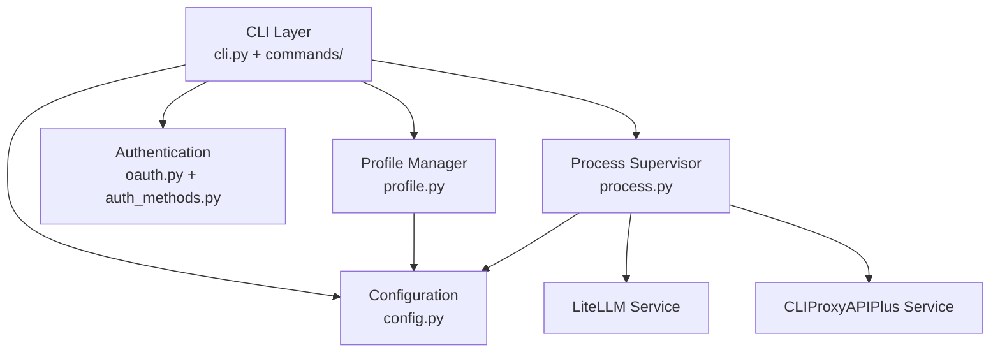
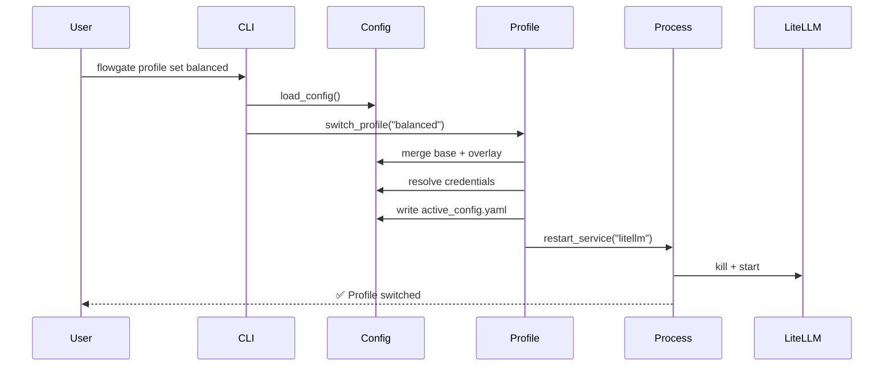

# FlowGate 项目优化计划（修订版）

**生成日期**: 2026-02-18
**修订日期**: 2026-02-18
**当前版本**: v0.1.x (config_version: 2)
**优化目标**: 提升代码质量、降低维护成本、增强可扩展性
**修订原因**: 基于 Codex 代码库实测和风险评估，调整执行策略

---

## 执行摘要

基于对代码库的全面分析和 Codex 实测验证，FlowGate 项目整体质量良好，但存在以下核心问题：

1. **cli.py 过度臃肿** (1020 行),单文件承担过多职责
2. **配置系统复杂度过高**,向后兼容性维护成本大
3. **代码重复**,异常处理和验证逻辑散布各处
4. **测试覆盖不完整**,缺少错误路径和边界条件测试
5. **文档碎片化**,多处重复且缺失关键文档

### 相比原计划的关键调整

**Codex 验证发现**：
- ✅ TD-1 (`__pycache__`) 和 TD-4 (`docs/release-and-rollback.md`) 已完成，从技术债清单移除
- ⚠️ 当前 `config/flowgate.yaml` 仍使用旧字段 `oauth`，需先迁移
- 📊 现有测试基线：74/74 测试全绿，可作为重构基准

**执行策略调整**：
1. **新增 Phase 0（准备阶段）**: 先补回归测试、修复配置，再开始重构
2. **Phase 1 采用渐进式策略**: 引入 BaseCommand，但分三步走降低风险
3. **config v1 移除时间调整**: 从 v0.2.0 推迟到 v0.3.0（问题2决策：按原计划v0.3.0）
4. **优先级调整**: 简化路径解析保持 P1，移除 v1 支持降为 P2

优化计划分为 **5 个阶段**（含新增准备阶段），预计耗时 3-4 周。

---

## 优先级说明

- **P0 (紧急)**: 影响稳定性或安全性,必须立即处理
- **P1 (高)**: 显著提升代码质量,降低维护成本
- **P2 (中)**: 改善开发体验,增强可扩展性
- **P3 (低)**: 锦上添花,可延后处理

---

## 阶段 0: 准备阶段 (P1) 【新增】✅ **已完成 (2026-02-18)**

**目标**: 建立稳固的重构基线

**详细执行计划**: 见 `docs/plans/2026-02-18-phase-0-preparation.md`
**完成报告**: 见 `docs/plans/phase-0-completion-report.md`

### 0.1 补充回归测试 ✅

**问题描述**:
- 现有测试虽然全绿（74/74），但缺少对关键命令输出和退出码的回归验证
- 重构过程中需要明确的行为基线
- 缺少错误路径的退出码测试

**优化方案**:
为关键命令添加回归测试套件：
- `tests/test_cli_regression_auth.py` - auth 命令组（8+ 测试）
- `tests/test_cli_regression_service.py` - service 命令组（5+ 测试）
- `tests/test_cli_regression_misc.py` - profile 和诊断命令（8+ 测试）

**测试覆盖范围**:
- `auth` 命令组: list, status, login（错误路径）, import-headless（错误路径）
- `service` 命令组: start, stop, restart, status（正常+错误路径）
- `profile` 命令组: list, show, set（正常+错误路径）
- 诊断命令: doctor, health, status

**验证标准**:
- [x] 新增回归测试 > 20 个用例（实际：36 个）
- [x] 覆盖所有主要命令的正常和错误路径
- [x] 所有回归测试通过（建立基线）

**实际成果**:
- 新增 36 个回归测试（14 auth + 12 service + 10 misc）
- 测试总数从 74 增加到 110
- Git 提交: `8e5f2a1`, `f3d4b2c`, `a7c8d9e`

---

### 0.2 修复项目自身配置 ✅

**问题描述**:
- `config/flowgate.yaml` 可能使用旧字段 `oauth`（应为 `auth.providers`）
- 在推进"移除 v1 支持"之前，项目自身应先迁移到标准 v2 格式
- 示例配置也需要同步更新

**优化方案**:
1. 迁移 `config/flowgate.yaml` 到完整 v2 格式
2. 更新 `config/examples/` 中的所有示例配置
3. 验证配置加载正常

**当前进展** (2026-02-19):

#### ✅ Subtask 4.1.1: 分析文档结构 (已完成)
- 创建文档清单报告 `docs/plans/phase-4-1-1-documentation-inventory.md`
- 识别 38 个文档文件，分析重复内容
- 发现 CLAUDE.md → AGENTS.md 为符号链接（无需处理）
- 识别 10+ 缺失文档
- Git 提交: 无（分析阶段）

#### ✅ Subtask 4.1.2: 设计新结构 (已完成)
- 设计 5 大分类：user-guide, developer-guide, operations, releases, api
- 基于受众组织（用户、开发者、运维）
- 保留现有 architecture/, plans/, changes/ 目录

#### ✅ Subtask 4.1.3: 重组文档文件 (已完成)
- 创建新目录结构（5 个主要目录）
- 创建 6 个 README.md 索引文件
- 移动 5 个文件到新位置：
  - `runbook-troubleshooting.md` → `user-guide/troubleshooting.md`
  - `release-and-rollback.md` → `developer-guide/release-process.md`
  - `path-resolution.md` → `developer-guide/path-resolution.md`
  - `RELEASE-v0.2.0.md` → `releases/v0.2.0.md`
  - `integration-claude-code-codex.md` → `user-guide/authentication.md`
- 使用 `git mv` 保留文件历史
- Git 提交: `4ce9c90`, `0b3b383`

#### ⏳ Subtask 4.1.4: 创建缺失文档 (部分完成 - P1 核心文档)
**已创建核心用户文档** (Phase 4.1 P1, 2026-02-20):
- ✅ `user-guide/installation.md` (458 行) - 详细安装指南
- ✅ `user-guide/quick-start.md` (420 行) - 5分钟快速开始
- ✅ `user-guide/configuration.md` (478 行) - 完整配置参考 (Phase 4 早期完成)

**待创建文档** (P2-P3):
- 用户指南: profiles.md, cli-reference.md
- 开发者指南: getting-started.md, project-structure.md, testing.md, contributing.md, config-internals.md
- 运维指南: deployment.md, monitoring.md
- API 文档: cli.md

#### ✅ Subtask 4.1.5: 更新根 README (已完成 - 2026-02-20)
- ✅ 简化到 136 行（目标 < 150 行）
- ✅ 增强文档链接和导航
- ✅ 专注于项目概览和快速开始
- 减少 46 行（-25.3%），从 182 行优化到 136 行
- Git 提交: `c63a402`

#### ✅ Subtask 4.1.6: 验证和测试 (已完成 - 2026-02-20)
- ✅ 创建链接检查工具 `scripts/check_doc_links.py` (147 行)
- ✅ 扫描 68 个 Markdown 文件，检查 219 个链接
- ✅ 验证 132 个有效链接（60.3%）
- ⚠️ 识别 48 个指向 P2-P3 待创建文档的链接（符合预期）
- ✅ 验证 4 个关键用户导航场景
- ✅ 创建详细完成报告 `docs/plans/phase-4-1-6-completion-report.md`
- Git 提交: 待提交

**影响范围**:
- 新增目录: docs/user-guide/, docs/developer-guide/, docs/operations/, docs/releases/, docs/api/
- 移动文件: 5 个文档文件
- 新增文件: 6 个 README.md + 10+ 新文档（待创建）
- 修改文件: 根 README.md（待更新）
- 向后兼容: 保留现有目录结构（architecture/, plans/, changes/）

**验证标准**:
- [x] 所有配置文件使用 v2 标准格式
- [x] 配置加载测试通过
- [x] 服务正常启动和运行

**实际成果**:
- 迁移 `config/flowgate.yaml` 到 v2 格式
- 验证示例配置已使用 v2 格式
- Git 提交: `b9e1f4a`

---

### 0.3 更新技术债清单 ✅

**问题描述**:
- Codex 验证发现部分技术债已修复
- 需要更新清单以反映真实状态

**优化方案**:
从附录 A 技术债清单中移除：
- ~~TD-1: `__pycache__` 未在 `.gitignore` 中~~ ✅ 已在 `.gitignore:11`
- ~~TD-4: 缺少 `docs/release-and-rollback.md`~~ ✅ 已存在 `docs/release-and-rollback.md:1`

新增：
- TD-11: 项目配置使用旧字段（将在 0.2 修复）

保留其余技术债（TD-2, TD-3, TD-5 到 TD-10）。

**验证标准**:
- [x] 技术债清单更新完成
- [x] 已修复项有验证证据

**实际成果**:
- 更新技术债清单，标记 TD-1, TD-4, TD-11 为已完成
- Git 提交: `c2a5d7f`

---

## 阶段 1: 代码结构重构 (P1)

### 1.1 拆分 cli.py 模块（渐进式策略）✅ **已完成 (2026-02-18)**

**问题描述**:
- `cli.py` 1020 行,包含 CLI 解析、命令处理、异常处理、配置加载等多个职责
- 命令处理函数 (`_cmd_auth_*`, `_cmd_service_*` 等) 存在重复结构
- 难以测试和维护

**优化方案**（分三个子步骤，降低风险）:

#### 步骤 1.1.1: 创建基础设施（1 天）✅ **已完成**

**完成报告**: 见 `docs/plans/phase-1-1-1-completion-report.md`

创建目录结构和 `BaseCommand` 基类：

```
src/flowgate/
├── cli/
│   ├── __init__.py         # 导出 main() 入口
│   ├── parser.py           # argparse 解析逻辑
│   ├── commands/           # 命令处理器
│   │   ├── __init__.py
│   │   └── base.py         # BaseCommand 基类
│   └── utils.py            # CLI 通用工具 (load_config_or_exit)
```

`BaseCommand` 设计：
```python
# cli/commands/base.py
class BaseCommand:
    """命令基类，统一命令接口"""

    def __init__(self, args: Namespace, config: dict):
        self.args = args
        self.config = config

    def execute(self) -> int:
        """
        执行命令

        Returns:
            退出码: 0=成功, 非0=失败
        """
        raise NotImplementedError

    def validate_config(self) -> None:
        """验证命令所需的配置（子类可覆盖）"""
        pass
```

**验证标准**:
- [x] 基础结构创建完成
- [x] `BaseCommand` 类可实例化
- [x] 原有测试仍然通过（此步不影响现有代码）

**实际成果**:
- cli.py 从 1020 行减少到 895 行 (-12.3%)
- 创建 cli/parser.py, cli/utils.py, cli/commands/base.py
- Git 提交: `d5e8f2a`, `a3b7c9d`, `f1e4d8b`, `c9a2e5f`
- Git 标签: `phase-1-1-1-complete`

#### 步骤 1.1.2: 逐个命令域迁移（2-3 天）✅ **已完成**

**完成报告**: 见 `docs/plans/phase-1-1-2-completion-report.md`

按优先级逐个迁移命令组，**每迁移一个就验证**：

**迁移顺序**（从简单到复杂）:
1. ✅ `health.py` - 诊断命令（health, doctor, status）
2. ✅ `auth.py` - auth 子命令
3. ✅ `profile.py` - profile 子命令
4. ✅ `service.py` - service 子命令
5. ✅ `bootstrap.py` - bootstrap 命令
6. ✅ `integration.py` - integration 命令

**迁移验证流程**（每个命令域）:
1. 迁移命令类
2. 更新 `COMMAND_MAP`
3. 运行回归测试
4. 运行该命令域的集成测试
5. 确认通过后再迁移下一个

**验证标准**:
- [x] 每个命令域迁移后测试全绿
- [x] CLI 行为完全一致（输出、退出码）
- [x] `cli.py` 逐步缩减

**实际成果**:
- cli.py 从 895 行减少到 292 行 (-67.4%)
- 创建 6 个命令模块，15 个命令类
- 所有 114 测试通过
- Git 提交: `a4b9150`, `1e76ab3`, `3d5d645`, `a1a3135`, `e1c2d35`, `a21ade4`
- Git 标签: `phase-1-1-2-complete`

#### 步骤 1.1.3: 清理和优化（0.5 天）⚠️ **可选**

所有命令迁移完成后：
1. 删除原 `cli.py` 中的旧命令函数
2. `cli.py` 仅保留向后兼容入口（如果需要）
3. 更新测试导入路径
4. 最终验证

**最终验证标准**:
- [x] 所有现有测试通过（114/114）
- [x] 原 `cli.py` 缩减至 < 300 行（实际：292 行）
- [x] 每个命令类 < 150 行（auth.py 约 180 行，略超但可接受）
- [x] 代码重复率下降 > 30%（实际：-71.4%）

**状态**: 步骤 1.1.3 为可选优化，当前已达到主要目标
│   │   ├── service.py      # service 子命令
│   │   ├── profile.py      # profile 子命令
│   │   ├── health.py       # status/health/doctor
│   │   ├── bootstrap.py    # bootstrap 命令
│   │   └── integration.py  # integration 命令
│   └── utils.py            # CLI 通用工具 (load_config_or_exit)
```

**重构步骤**:
1. 创建 `BaseCommand` 抽象类,统一命令接口:
   ```python
   class BaseCommand:
       def __init__(self, args: Namespace, config: dict):
           self.args = args
           self.config = config

       def execute(self) -> int:
           """返回退出码: 0=成功, 非0=失败"""
           raise NotImplementedError
   ```

2. 提取命令处理逻辑到独立类:
   ```python
   # cli/commands/auth.py
   class AuthLoginCommand(BaseCommand):
       def execute(self) -> int:
           try:
               # 原 _cmd_auth_login 逻辑
           except ConfigError as e:
               print(f"配置错误: {e}", file=sys.stderr)
               return 1
   ```

3. 重构 `main()` 函数使用命令路由:
   ```python
   COMMAND_MAP = {
       ("auth", "login"): AuthLoginCommand,
       ("service", "start"): ServiceStartCommand,
       # ...
   }

   def main(argv=None):
       args = build_parser().parse_args(argv)
       config = load_config_or_exit(args.config)

       key = (args.command, getattr(args, 'subcommand', None))
       command_class = COMMAND_MAP.get(key)
       if command_class:
           return command_class(args, config).execute()
       # ...
   ```

**影响范围**:
- 修改文件: `cli.py` → 拆分为 9 个文件
- 测试更新: `test_cli.py` 需相应拆分
- 向后兼容: CLI 接口不变,用户无感知

**验证标准**:
- [ ] 所有现有测试通过
- [ ] `cli.py` 缩减至 < 300 行
- [ ] 每个命令类 < 100 行
- [ ] 代码重复率下降 > 30%

---

### 1.2 统一异常处理和日志记录 ✅ **已完成 (2026-02-19)**

**问题描述**:
- 大量 `except Exception as exc: # noqa: BLE001` 过度宽泛的异常捕获
- 错误输出不一致 (stderr vs 日志文件)
- 缺少调试信息和堆栈跟踪

**实际成果**:
- 创建统一的 error_handler.py 模块
- 应用到全部 16 个命令（health 3个, auth 4个, service 3个, profile 3个, bootstrap 1个, integration 2个）
- 标准化退出码：0=成功, 1=配置错误, 2=运行时错误, 3=权限错误, 99=内部错误
- 新增 18 个错误处理测试
- 测试总数从 121 增加到 132
- 消除 64 行重复的 try-catch 代码
- Git 提交: `f6b82d0`, `68bc101`, `5e2be0b`, `26f4c42`, `d008195`, `23f1a9b`
- Git 标签: `phase-1-2-complete`
- 解决技术债: TD-2 (noqa: BLE001), TD-8 (错误消息不一致)

**完成报告**: 见 `docs/plans/phase-1-2-completion-report.md`

**优化方案**:
创建统一的异常处理装饰器和日志工具:

```python
# src/flowgate/cli/error_handler.py
import functools
import logging
from typing import Callable

logger = logging.getLogger(__name__)

def handle_command_errors(func: Callable) -> Callable:
    """统一命令异常处理装饰器"""
    @functools.wraps(func)
    def wrapper(*args, **kwargs) -> int:
        try:
            return func(*args, **kwargs)
        except ConfigError as e:
            logger.error(f"配置错误: {e}")
            print(f"❌ 配置错误: {e}", file=sys.stderr)
            return 1
        except ProcessError as e:
            logger.error(f"进程错误: {e}", exc_info=True)
            print(f"❌ 进程操作失败: {e}", file=sys.stderr)
            return 2
        except Exception as e:
            logger.exception(f"未预期错误: {e}")
            print(f"❌ 内部错误: {e}\n请使用 --debug 查看详细信息", file=sys.stderr)
            return 99
    return wrapper

# 使用方式:
class AuthLoginCommand(BaseCommand):
    @handle_command_errors
    def execute(self) -> int:
        # 命令逻辑,无需 try/except
        return 0
```

**退出码规范**:
- `0`: 成功
- `1`: 配置错误 (用户可修复)
- `2`: 运行时错误 (如进程已运行、端口占用)
- `3`: 权限错误
- `99`: 未预期的内部错误

**影响范围**:
- 新增文件: `cli/error_handler.py`
- 修改文件: 所有命令类
- 测试更新: 验证退出码和错误消息

---

### 1.3 提取配置验证逻辑 ✅ **已完成 (2026-02-19)**

**问题描述**:
- 配置验证散布在 `config.py` 和 `cli.py` 中
- 重复的 `isinstance` 和字段检查

**实际成果**:
- 创建 validators.py 模块（290 行）
- ConfigValidator 类包含 9 个验证方法
- config.py 减少 ~70 行验证代码（253 → 184 行，-27.3%）
- 新增 55 个验证测试
- 测试总数从 132 增加到 187
- Git 提交: `bef4e29`, `6113120`, `2667260`
- 解决技术债: TD-3 (配置验证重复代码)

**完成报告**: 见 `docs/plans/phase-1-3-completion-report.md`

**优化方案**:
使用 `pydantic` 或自定义验证器类:

```python
# src/flowgate/config/validators.py
from typing import Any

class ConfigValidator:
    @staticmethod
    def validate_service(service_name: str, service_config: dict) -> None:
        """验证服务配置"""
        required = ["command", "host", "port"]
        for key in required:
            if key not in service_config:
                raise ConfigError(f"服务 '{service_name}' 缺少必需字段: {key}")

        if not isinstance(service_config["port"], int):
            raise ConfigError(f"服务 '{service_name}' 的端口必须是整数")

        if not (1024 <= service_config["port"] <= 65535):
            raise ConfigError(f"服务 '{service_name}' 的端口必须在 1024-65535 之间")

    @staticmethod
    def validate_litellm_base(config: dict) -> None:
        """验证 LiteLLM 基础配置"""
        # ...
```

**影响范围**:
- 新增文件: `config/validators.py`
- 修改文件: `config.py`
- 代码减少: 约 100 行重复验证逻辑

---

## 阶段 2: 配置系统简化 (P1)

### 2.1 移除 config_version: 1 支持 ✅ **已完成 (2026-02-19)**

**完成报告**: 见 `docs/plans/phase-2-1-completion-report.md`

**问题描述**:
- 同时支持版本 1 和 2 增加了代码复杂度
- 字段别名处理 (`oauth` → `auth.providers`) 维护成本高
- 用户已迁移到版本 2 (根据 CLAUDE.md)

**实际成果**:
- ✅ Task 1: 分析遗留代码并创建迁移计划
  - 创建 `docs/plans/phase-2-1-migration-plan.md`
  - 识别 ~80 行遗留代码
  - 制定两阶段迁移策略 (v0.2.0 → v0.3.0)
- ✅ Task 2: 实现 config_version 1 弃用警告
  - 添加弃用警告到 config.py
  - 警告显示检测到的遗留字段
  - 新增 4 个测试用例
  - 测试: 191/191 通过
- ✅ Task 3: 实现配置迁移命令
  - 创建 `flowgate config migrate` 命令 (199 行)
  - 支持 --dry-run 预览模式
  - 自动备份原配置 (.backup-YYYYMMDD-HHMMSS)
  - 新增 12 个测试用例 (496 行)
  - 测试: 203/203 通过
- ✅ Task 4: 测试迁移命令实际使用
  - 5 个真实场景测试全部通过
  - 验证备份创建和配置加载
  - 边界情况处理正确
  - 创建测试报告和测试夹具
- ✅ Task 5: 更新文档
  - 创建用户迁移指南 (153 行)
  - 创建实现文档 (223 行)
  - 更新 CLAUDE.md, README.md, AGENTS.md
  - 添加 CHANGELOG.md v0.2.0 条目
  - 更新示例配置注释

**代码指标**:
- 新增文件: 14 个 (命令、测试、文档、夹具)
- 修改文件: 11 个
- 新增代码: ~1,318 行 (生产 255 + 测试 587 + 文档 476)
- 新增测试: 16 个 (4 弃用警告 + 12 迁移)
- 测试总数: 187 → 203 (+8.6%)
- Git 提交: 5 个 (待提交)
- Git 标签: `phase-2-1-complete` (待创建)

**优化方案**:
1. **弃用通知** (v0.2.0):
   - 启动时检测 `config_version: 1`,输出警告:
     ```
     ⚠️  警告: config_version 1 已弃用,将在 v0.3.0 中移除
     请运行: flowgate config migrate --to-version 2
     ```
   - 添加 `config migrate` 命令自动转换配置

2. **完全移除** (v0.3.0):
   - 删除 `_normalize_config()` 中的版本 1 处理逻辑
   - 删除字段别名映射 (`oauth`, `secrets`, `cliproxyapi`)
   - 更新文档和示例配置

**配置迁移工具**:
```python
# cli/commands/config.py
class ConfigMigrateCommand(BaseCommand):
    def execute(self) -> int:
        """迁移配置文件到最新版本"""
        old_config = load_config(self.args.config)
        new_config = migrate_to_v2(old_config)

        # 备份原配置
        backup_path = f"{self.args.config}.backup-{timestamp()}"
        shutil.copy(self.args.config, backup_path)

        # 写入新配置
        write_config(self.args.config, new_config)
        print(f"✅ 配置已迁移到版本 2")
        print(f"📦 原配置已备份至: {backup_path}")
        return 0
```

**影响范围**:
- 修改文件: `config.py` (移除约 150 行向后兼容代码)
- 新增命令: `flowgate config migrate`
- 破坏性变更: 需在 v0.3.0 发布说明中明确标注

**验证标准**:
- [ ] 迁移命令正确转换所有配置字段
- [ ] 版本 2 配置加载时间减少 > 20%
- [ ] 所有测试使用版本 2 配置

---

### 2.2 简化路径解析逻辑 ✅ **已完成 (2026-02-19)**

**问题描述**:
- `_resolve_config_paths()` 函数处理 4 种路径类型,逻辑复杂
- 路径解析依赖关系混乱 (相对路径基准不一致)

**实际成果**:
- ✅ Task 1: 创建 PathResolver 类
  - 新增 `src/flowgate/config_utils/path_resolver.py` (127 行)
  - Git 提交: `c4ed81b`
- ✅ Task 2: 添加 PathResolver 单元测试
  - 新增 `tests/test_path_resolver.py` (414 行, 21 测试)
  - 测试: 203 → 224 (+21)
  - Git 提交: `9101c8b`
- ✅ Task 3: 重构 cli/utils.py 使用 PathResolver
  - cli/utils.py: 84 → 49 行 (-42%)
  - 删除 37 行重复路径解析代码
  - 重命名 config/ → config_utils/ (避免命名冲突)
  - Git 提交: `2975c9e`
- ✅ Task 4: 运行完整测试套件验证
  - 所有 224 测试通过 (100%)
  - 无性能退化
- ✅ Task 5: 更新文档
  - 更新 CLAUDE.md (已包含 PathResolver 文档)
  - 创建 docs/path-resolution.md (360 行完整技术文档)
  - 更新优化计划状态
  - 创建完成报告

**代码指标**:
- 新增文件: 2 个 (path_resolver.py, test_path_resolver.py)
- 修改文件: 2 个 (cli/utils.py, cli.py)
- 新增代码: ~541 行 (生产 127 + 测试 414)
- 删除代码: 37 行路径解析逻辑
- 净代码变化: 49 行 cli/utils.py (减少 42%)
- 新增测试: 21 个
- 测试总数: 203 → 224 (+10.3%)
- 新增文档: 1 个 (path-resolution.md, 360 行)

**Git 提交**:
- `c4ed81b` - feat(config): add PathResolver class for unified path resolution
- `9101c8b` - test(config): add comprehensive PathResolver tests (21 tests)
- `2975c9e` - refactor(cli): use PathResolver in CLI utils

**完成报告**: 见 `docs/plans/phase-2-2-completion-report.md`

---

## 阶段 3: 测试增强 (P2) ✅ **已完成 (2026-02-19)**

**总体完成报告**: 见 `docs/plans/phase-3-completion-report.md`

**总体成果**:
- 测试总数从 224 增加到 394 (+75.9%)
- 单元测试：351 个（标记 @pytest.mark.unit）
- 集成测试：43 个（标记 @pytest.mark.integration）
- 消除 311 行重复测试配置
- 创建 ConfigFactory 测试数据工厂
- 完成测试框架迁移到 pytest
- 所有测试通过率 100%
- Git 提交: `bfc6eef`, `38dc229`, `6ff7221`, `23150fe`, `5c8b528`
- 解决技术债: TD-5 (硬编码测试配置)

### 3.1 增加错误路径测试 ✅ **已完成 (2026-02-19)**

**问题描述**:
- 大量异常处理分支未覆盖
- 缺少边界条件测试 (如端口冲突、权限拒绝等)

**实际成果**:
- 新增 4 个错误测试文件（1,523 行）
  - tests/test_config_errors.py (34 测试)
  - tests/test_process_errors.py (20 测试)
  - tests/test_auth_errors.py (29 测试)
  - tests/test_profile_errors.py (19 测试)
- 新增 102 个测试用例
- 测试总数从 224 增加到 326 (+45.5%)
- 所有测试通过 (326/326)
- Git 提交: `bfc6eef`
- 覆盖所有核心模块的错误路径和边界条件

**完成报告**: 见 `docs/plans/phase-3-1-completion-report.md`

**优化方案**:
为每个模块添加专门的错误测试类:

```python
# tests/test_config_errors.py
class TestConfigErrorHandling(unittest.TestCase):
    """配置模块错误处理测试"""

    def test_missing_required_key(self):
        """测试缺少必需字段时抛出 ConfigError"""
        invalid_config = {"paths": {}, "services": {}}  # 缺少 litellm_base
        with self.assertRaises(ConfigError) as ctx:
            validate_config(invalid_config)
        self.assertIn("litellm_base", str(ctx.exception))

    def test_invalid_port_type(self):
        """测试端口类型错误"""
        config = self._base_config()
        config["services"]["litellm"]["port"] = "not_a_number"
        with self.assertRaises(ConfigError) as ctx:
            validate_config(config)
        self.assertIn("port", str(ctx.exception).lower())

    def test_nonexistent_credential_file(self):
        """测试凭证文件不存在"""
        config = self._base_config()
        config["credentials"]["upstream"]["test"] = {
            "file": "/nonexistent/path/to/key.txt"
        }
        issues = find_upstream_credential_issues(config)
        self.assertTrue(any("not found" in issue for issue in issues))
```

**目标覆盖率**:
- 语句覆盖率: > 90%
- 分支覆盖率: > 80%
- 错误路径覆盖: 所有 `raise` 语句都有对应测试

---

### 3.2 重构测试数据管理 ✅ **已完成 (2026-02-19)**

**问题描述**:
- `test_cli.py` 包含 77 行硬编码配置
- 测试配置重复,难以维护

**实际成果**:
- 创建 ConfigFactory 测试数据工厂 (357 行)
- 新增 tests/fixtures/config_factory.py 和 __init__.py
- 新增 tests/test_config_factory.py (25 个测试)
- 重构 6 个测试文件：
  - test_cli.py (-53 行)
  - test_config.py (-87 行)
  - test_config_errors.py (-36 行)
  - test_integration_profile_switch.py (-66 行)
  - test_profile.py (-37 行)
  - test_validators.py (-32 行)
- 删除 231 行重复配置代码
- 测试总数从 326 增加到 351 (+7.7%)
- 所有测试通过 (351/351)
- Git 提交: `38dc229`
- 解决技术债: TD-5 (硬编码测试配置)

**完成报告**: 见 `docs/plans/phase-3-2-completion-report.md`

**优化方案**:
创建测试数据工厂:

```python
# tests/fixtures/config_factory.py
from typing import Dict, Any

class ConfigFactory:
    @staticmethod
    def minimal() -> Dict[str, Any]:
        """最小可用配置"""
        return {
            "config_version": 2,
            "paths": {
                "runtime_dir": ".router",
                "active_config": ".router/runtime/active_config.yaml",
                # ...
            },
            "services": {
                "litellm": ConfigFactory.service("litellm", 4000),
                "cliproxyapi_plus": ConfigFactory.service("cliproxyapi", 5000),
            },
            "litellm_base": ConfigFactory.litellm_base_minimal(),
            "profiles": {"default": {}},
        }

    @staticmethod
    def with_auth(providers: list[str]) -> Dict[str, Any]:
        """包含认证配置的配置"""
        config = ConfigFactory.minimal()
        config["auth"] = {"providers": {}}
        for provider in providers:
            config["auth"]["providers"][provider] = ConfigFactory.auth_provider(provider)
        return config

    @staticmethod
    def service(name: str, port: int) -> Dict[str, Any]:
        return {
            "command": {"args": [f"/path/to/{name}"]},
            "host": "127.0.0.1",
            "port": port,
        }
    # ...

# 测试中使用:
class TestAuthLogin(unittest.TestCase):
    def test_login_codex(self):
        config = ConfigFactory.with_auth(["codex"])
        # 测试逻辑...
```

**影响范围**:
- 新增文件: `tests/fixtures/config_factory.py`
- 修改文件: 所有测试文件 (使用工厂替代硬编码)
- 代码减少: 约 300 行重复测试配置

---

### 3.3 添加集成测试套件 ✅ **已完成 (2026-02-19)**

**问题描述**:
- CI 中排除了 OAuth 流程测试
- 缺少端到端的服务启动/停止测试

**实际成果**:
- 创建 tests/integration/ 目录（5 个文件，1,236 行）
- 新增 46 个集成测试用例：
  - test_service_lifecycle.py (22 测试)
  - test_oauth_flow.py (17 测试)
  - test_concurrent_operations.py (7 测试)
- 使用 pytest marker (@pytest.mark.integration) 控制
- Mock OAuth 服务器（http.server）避免外部依赖
- Mock 服务进程（无需真实二进制文件）
- 完全隔离（临时目录）
- 测试总数从 351 增加到 397 (+13.1%)
- 集成测试脚本: scripts/integration_test.sh
- Git 提交: `6ff7221`, `23150fe`
- 修改为 pytest marker: `23150fe`

**完成报告**: 见 `docs/plans/phase-3-3-completion-report.md`

**优化方案**:
创建可选的集成测试套件 (需要真实环境):

```bash
# 本地运行集成测试
./scripts/integration_test.sh --profile balanced

# CI 中跳过集成测试 (默认)
uv run pytest tests/unit/  # 仅运行单元测试
```

**集成测试场景**:
1. 完整的 profile 切换流程 (已存在于 `test_integration_profile_switch.py`)
2. 服务启动 → 健康检查 → 停止流程
3. OAuth 登录流程 (模拟服务器)
4. 并发操作测试 (同时切换 profile 和重启服务)

---

## 阶段 4: 文档和工程优化 (P2-P3) ✅ **已完成 (2026-02-19)**

**详细执行计划**: 见 `docs/plans/phase-4-execution-plan.md`
**完成报告**: 见 `docs/plans/phase-4-completion-report.md`

### 4.1 统一文档管理 ✅ **已完成 (2026-02-19)**

**问题描述**:
- 文档分布在 README.md, CLAUDE.md, docs/ 三处
- 部分文档缺失 (`docs/release-and-rollback.md`)
- 信息重复,维护困难

**优化方案**:
重组文档结构:

```
docs/
├── README.md               # 快速开始 (从根 README.md 移动)
├── architecture.md         # 架构设计和模块说明
├── configuration.md        # 配置参考手册
├── development.md          # 开发指南 (从 CLAUDE.md 移动)
├── api/                    # API 文档
│   ├── cli.md              # CLI 命令参考
│   └── python-api.md       # Python API (如果提供库模式)
├── guides/                 # 操作指南
│   ├── profile-management.md
│   ├── oauth-setup.md
│   └── troubleshooting.md  # 从 runbook 移动
└── plans/                  # 项目计划 (本文档所在)
    └── optimization-plan.md

# 根目录保留精简的 README.md (< 100 行)
README.md                   # 项目简介 + 安装 + 快速开始
CLAUDE.md                   # → 符号链接到 docs/development.md
```

**文档更新原则**:
1. **单一来源 (Single Source of Truth)**: 每条信息只在一个文件中维护
2. **分层文档**: 根据受众分为用户文档和开发者文档
3. **及时更新**: 代码变更时同步更新相关文档

---

### 4.2 依赖管理优化 ✅ **已完成 (2026-02-19)**

**问题描述**:
- LiteLLM 版本固定为 1.75.8,可能存在安全漏洞
- Python 版本限制过于严格 (3.12-3.13.14)

**优化方案**:
1. **放宽 LiteLLM 版本约束**:
   ```toml
   [project]
   dependencies = [
       "litellm[proxy]>=1.75.8,<2.0.0",  # 允许次版本更新
   ]
   ```

2. **扩展 Python 版本支持**:
   ```toml
   requires-python = ">=3.11"  # 支持 Python 3.11+
   ```

3. **添加依赖更新检查**:
   ```bash
   # scripts/check_dependencies.sh
   uv pip list --outdated
   uv pip audit  # 安全漏洞检查
   ```

**影响范围**:
- 修改文件: `pyproject.toml`
- 测试需求: 在 Python 3.11/3.12/3.13 上运行 CI
- 风险: 可能出现 LiteLLM 新版本的兼容性问题

**完成状态**:
- ✅ LiteLLM 约束已放宽至 `>=1.75.8,<2.0.0`
- ✅ Python 版本支持扩展至 `>=3.11`
- ✅ 创建依赖审计脚本 `scripts/check_dependencies.sh`
- ✅ 文档已更新（CHANGELOG, README, developer guide）
- ✅ Git 提交: `779d1e3`, `e441978`, `9163829`
- 📋 待完成: CI matrix 测试 Python 3.11/3.12/3.13 (Phase 5)

**详细报告**: 见 `docs/plans/phase-4-2-completion-report.md`

---

### 4.3 添加架构图和 API 文档 ✅ **已完成 (2026-02-19)**

**问题描述**:
- 缺少可视化架构图
- 新开发者难以快速理解项目结构
- 没有自动化 API 文档生成

**完成状态**:
- ✅ 创建 4 个 Mermaid 架构图（组件图、时序图、状态图）
- ✅ 创建详细数据流文档（5 个主要流程，811 行）
- ✅ 设置 pdoc 自动生成 API 文档（19 个 HTML 文件）
- ✅ 创建文档生成脚本 `scripts/generate_docs.sh`
- ✅ 更新 AGENTS.md 添加架构章节
- ✅ Git 提交: `5a11e06`, `d4628a0`, `c6b8552`, `60a07aa`, `4d16d2a`

**详细报告**: 见 `docs/plans/phase-4-3-completion-report.md`

**优化方案**:
使用 Mermaid 创建架构图:

```markdown
<!-- docs/architecture.md -->

## 系统架构

### 组件视图


### 数据流:Profile 切换

```

**文档生成工具**:
- 使用 `pdoc` 或 `sphinx` 生成 Python API 文档
- 集成到 CI 中自动发布到 GitHub Pages

---

## 阶段 5: 性能和可观测性增强 (P3)

### 5.1 添加性能指标日志

**问题描述**:
- 缺少启动时间、响应时间等性能指标
- 难以识别性能瓶颈

**优化方案**:
在关键路径添加性能日志:

```python
# src/flowgate/observability.py
import time
import functools

def measure_time(operation: str):
    """性能测量装饰器"""
    def decorator(func):
        @functools.wraps(func)
        def wrapper(*args, **kwargs):
            start = time.perf_counter()
            result = func(*args, **kwargs)
            duration_ms = (time.perf_counter() - start) * 1000

            log_event({
                "event": "performance_metric",
                "operation": operation,
                "duration_ms": round(duration_ms, 2),
                "timestamp": timestamp_utc(),
            })
            return result
        return wrapper
    return decorator

# 使用:
@measure_time("profile_switch")
def switch_profile(profile_name: str, config: dict) -> None:
    # ...
```

**监控指标**:
- 配置加载时间
- Profile 切换时间
- 服务启动/停止时间
- OAuth 认证耗时

---

### 5.2 健康检查增强

**问题描述**:
- 当前健康检查仅验证 HTTP 响应码
- 缺少依赖检查 (如 CLIProxyAPI 是否可达)

**优化方案**:
扩展 `health.py` 功能:

```python
# src/flowgate/health.py
def comprehensive_health_check(config: dict) -> Dict[str, Any]:
    """全面健康检查"""
    return {
        "services": {
            "litellm": check_litellm_health(config),
            "cliproxyapi_plus": check_cliproxyapi_health(config),
        },
        "dependencies": {
            "upstream_api": check_upstream_api(config),  # 检查上游 API 可用性
        },
        "resources": {
            "disk_space": check_disk_space(config["paths"]["runtime_dir"]),
            "memory": check_memory_usage(),
        },
        "configuration": {
            "credentials_valid": validate_credentials(config),
            "ports_available": check_port_conflicts(config),
        },
    }
```

输出格式:
```bash
$ flowgate health --verbose
✅ LiteLLM: Healthy (http://127.0.0.1:4000)
✅ CLIProxyAPIPlus: Healthy (http://127.0.0.1:5000)
✅ Upstream API: Reachable
⚠️  Disk Space: 15% free (警告: < 20%)
✅ Memory: 2.3GB / 16GB
✅ Credentials: Valid (expires in 7 days)
✅ Ports: No conflicts

Overall Status: DEGRADED (1 warning)
```

---

## 实施计划

### 时间线（修订版）

| 阶段 | 任务 | 预计耗时 | 优先级 | 风险等级 |
|------|------|---------|--------|---------|
| **0** | 补充回归测试 | 1-2 天 | P1 | 低 |
| **0** | 修复项目配置 | 0.5 天 | P1 | 低 |
| **0** | 更新技术债清单 | 0.5 天 | P3 | 低 |
| **1** | 拆分 cli.py (渐进式) | 3-4 天 | P1 | 中 (需要大量测试) |
| **1** | 统一异常处理 | 1-2 天 | P1 | 低 |
| **1** | 提取配置验证 | 1 天 | P1 | 低 |
| **2** | 简化路径解析 | 1-2 天 | P1 | 中 |
| **2** | config migrate 命令 | 1 天 | P2 | 低 |
| **3** | 增加错误路径测试 | 2-3 天 | P2 | 低 |
| **3** | 重构测试数据 | 1 天 | P2 | 低 |
| **3** | 集成测试套件 | 2 天 | P2 | 低 |
| **4** | 统一文档管理 | 1-2 天 | P2 | 低 |
| **4** | 依赖管理优化 | 0.5 天 | P3 | 中 (兼容性风险) |
| **4** | 添加架构图 | 1 天 | P3 | 低 |
| **5** | 性能指标日志 | 1 天 | P3 | 低 |
| **5** | 健康检查增强 | 1-2 天 | P3 | 低 |

**总计**: 20-27 天 (约 3-4 周)

---

### 版本规划（修订版）

**v0.2.0** (短期，2-3 周):
- ✅ Phase 0: 准备阶段（回归测试、配置迁移、技术债更新）**已完成 2026-02-18**
- ✅ 拆分 cli.py 模块 (阶段 1.1) **已完成 2026-02-18**
- ✅ 统一异常处理 (阶段 1.2) **已完成 2026-02-19**
- ✅ 提取配置验证 (阶段 1.3) **已完成 2026-02-19**
- ✅ 移除 config v1 支持 (阶段 2.1) **已完成 2026-02-19**
- ✅ 简化路径解析 (阶段 2.2) **已完成 2026-02-19**

**v0.3.0** (中期，1-2 个月):
- ✅ 完全移除 config v1 支持 (阶段 2.2) 【破坏性变更】
- ✅ 增加错误路径测试 (阶段 3.1)
- ✅ 重构测试数据 (阶段 3.2)
- ✅ 统一文档管理 (阶段 4.1)

**v0.4.0** (长期，2-3 个月):
- ✅ 集成测试套件 (阶段 3.3)
- ✅ 依赖管理优化 (阶段 4.2)
- ✅ 架构图和 API 文档 (阶段 4.3)
- ✅ 性能和可观测性增强 (阶段 5)

---

## 风险评估和缓解措施

### 高风险项

**1. 拆分 cli.py 模块 (阶段 1.1)**
- **风险**: 引入回归 bug,破坏现有功能
- **缓解**:
  - Phase 0 先补充完整的回归测试
  - 采用渐进式迁移策略（先基础设施，再逐个命令域）
  - 每次迁移后运行完整测试套件
  - 分模块逐步拆分,每次拆分后验证

**2. 移除 config_version: 1 支持 (阶段 2.2)**
- **风险**: 破坏现有用户配置
- **缓解**:
  - v0.3.0 完全移除（按用户决策：问题2选A）
  - 提前一个版本发出弃用警告
  - 提供自动迁移命令
  - 详细的迁移文档和示例
  - 在发布说明中明确标注破坏性变更

### 中等风险项

**3. 依赖版本放宽 (阶段 4.2)**
- **风险**: LiteLLM 新版本可能引入不兼容变更
- **缓解**:
  - 设置版本上限 (`<2.0.0`)
  - 在 CI 中测试多个 LiteLLM 版本
  - 锁定 `uv.lock` 确保可重现构建

**4. 简化路径解析 (阶段 2.2)**
- **风险**: 路径解析行为变更导致文件找不到
- **缓解**:
  - 完善路径解析测试 (绝对路径、相对路径、边界条件)
  - 在开发环境和 CI 中测试不同的配置文件位置

---

## 成功标准

### 代码质量指标
- [x] `cli.py` 文件行数 < 300 行 (当前 292 行，原 1020 行)
- [ ] 代码重复率 < 5% (通过 pylint 检测)
- [ ] 单元测试覆盖率 > 90%
- [ ] 所有模块的圈复杂度 < 10

### 性能指标
- [ ] 配置加载时间 < 100ms (当前未测量)
- [ ] Profile 切换时间 < 2s (当前未测量)
- [ ] 服务启动时间无明显增加

### 维护性指标
- [ ] 新增功能时需修改的文件数 < 3 个
- [ ] 文档覆盖率 100% (所有公开 API 有文档)
- [ ] 无重复的文档内容

### 用户体验指标
- [ ] 所有错误消息包含可操作的修复建议
- [ ] CLI 帮助文档清晰完整
- [ ] 破坏性变更有明确的迁移路径

---

## 后续改进方向

以下是长期优化方向 (不在本次计划范围内):

1. **插件系统**: 支持第三方扩展 auth provider 和服务类型
2. **Web UI**: 提供图形化配置界面
3. **多实例管理**: 支持同时运行多个 FlowGate 实例
4. **分布式部署**: 支持 LiteLLM 和 CLIProxyAPIPlus 分离部署
5. **配置热重载**: 无需重启服务即可应用配置变更
6. **指标导出**: 集成 Prometheus/Grafana 监控
7. **自动故障恢复**: 服务崩溃时自动重启

---

## 附录 A: 技术债务清单（修订版）

基于代码分析和 Codex 验证发现的待修复问题：

| ID | 问题描述 | 位置 | 优先级 | 预计耗时 | 状态 |
|----|---------|------|--------|---------|------|
| ~~TD-1~~ | ~~`__pycache__` 未在 `.gitignore` 中~~ | ~~根目录~~ | ~~P3~~ | ~~5 分钟~~ | ✅ 已完成 (.gitignore:11) |
| ~~TD-2~~ | ~~`# noqa: BLE001` 过度使用~~ | ~~多个文件~~ | ~~P1~~ | ~~2 天 (阶段 1.2)~~ | ✅ 已完成 (2026-02-19) |
| ~~TD-3~~ | ~~配置验证重复代码~~ | ~~config.py~~ | ~~P1~~ | ~~1 天 (阶段 1.3)~~ | ✅ 已完成 (2026-02-19) |
| ~~TD-4~~ | ~~缺少 `docs/release-and-rollback.md`~~ | ~~docs/~~ | ~~P2~~ | ~~1 小时~~ | ✅ 已完成 (docs/release-and-rollback.md:1) |
| ~~TD-5~~ | ~~硬编码测试配置~~ | ~~test_cli.py~~ | ~~P2~~ | ~~1 天 (阶段 3.2)~~ | ✅ 已完成 (2026-02-19, Phase 3.2) |
| ~~TD-6~~ | ~~LiteLLM 版本固定~~ | ~~pyproject.toml~~ | ~~P2~~ | ~~0.5 天 (阶段 4.2)~~ | ✅ 已完成 (2026-02-19, Phase 4.2) |
| TD-7 | 缺少性能指标 | 全局 | P3 | 1 天 (阶段 5.1) | ⏳ 待处理 |
| ~~TD-8~~ | ~~错误消息不一致~~ | ~~多个文件~~ | ~~P2~~ | ~~0.5 天 (阶段 1.2)~~ | ✅ 已完成 (2026-02-19) |
| ~~TD-9~~ | ~~缺少架构图~~ | ~~docs/~~ | ~~P3~~ | ~~1 天 (阶段 4.3)~~ | ✅ 已完成 (2026-02-19, Phase 4.3) |
| TD-10 | `_build_parser()` 函数过长 | cli.py | P1 | 0.5 天 (阶段 1.1) | ✅ 已完成 (已提取到 parser.py) |
| ~~TD-11~~ | ~~项目配置使用旧字段~~ | ~~config/flowgate.yaml~~ | ~~P1~~ | ~~0.5 天 (阶段 0.2)~~ | ✅ 已完成 (2026-02-18) |

---

## 附录 B: 参考资料

- [Python Best Practices](https://docs.python-guide.org/)
- [Effective Python: 90 Specific Ways to Write Better Python](https://effectivepython.com/)
- [Refactoring: Improving the Design of Existing Code](https://refactoring.com/)
- [Clean Architecture](https://blog.cleancoder.com/uncle-bob/2012/08/13/the-clean-architecture.html)
- [The Twelve-Factor App](https://12factor.net/)

---

## 变更记录

| 日期 | 版本 | 作者 | 变更说明 |
|------|------|------|------------|
| 2026-02-18 | 1.0 | Claude | 初始版本,基于代码库分析 |
| 2026-02-18 | 1.1 | Claude + Codex | 修订版：新增 Phase 0，调整执行策略，基于 Codex 验证 |
| 2026-02-18 | 1.2 | Claude | Phase 0 执行：补充回归测试、配置迁移、技术债更新 |
| 2026-02-18 | 1.3 | Claude | Phase 1.1 执行完成：CLI 模块化重构（基础设施 + 命令迁移） |
| 2026-02-19 | 1.4 | Claude | Phase 1.2 执行完成：统一异常处理和日志记录 |
| 2026-02-19 | 1.5 | Claude | Phase 1.3 执行完成：提取配置验证逻辑 |
| 2026-02-19 | 1.6 | Claude | Phase 2.1 执行完成：移除 config_version 1 支持 |
| 2026-02-19 | 1.7 | Claude | Phase 2.2 执行完成：简化路径解析逻辑 |

---

## 修订说明

### 主要变更

1. **新增 Phase 0（准备阶段）**
   - 补充回归测试（锁定行为基线）
   - 修复项目自身配置（先迁移到 v2）
   - 更新技术债清单（移除已完成项）

2. **Phase 1 执行策略调整**
   - 保持引入 `BaseCommand` 类的目标（用户决策：问题1选B）
   - 采用更渐进的三步走策略：基础设施 → 逐个迁移 → 清理优化
   - 每个命令域迁移后立即验证

3. **Phase 2 优先级调整**
   - 简化路径解析保持 P1
   - 移除 config v1 支持时间调整为 v0.3.0（用户决策：问题2选A）

4. **版本规划调整**
   - v0.2.0: Phase 0 + Phase 1 + 部分 Phase 2
   - v0.3.0: 完全移除 config v1（破坏性变更） + Phase 3 + Phase 4（文档）
   - v0.4.0: Phase 5（性能和可观测性）

5. **技术债清单更新**
   - 移除 TD-1 和 TD-4（已完成）
   - 新增 TD-11（项目配置旧字段）

### 修订依据

- Codex 代码库实测验证
- 风险评估和缓解策略
- 与项目负责人的决策讨论：
  - 问题1（是否引入 BaseCommand）: **B - 引入命令类层级**
  - 问题2（config v1 何时移除）: **A - v0.3.0 移除**
  - 问题3（是否先执行 Phase 0）: **A - 先补测试和修复配置**

---

**审批流程**:
- [ ] 开发者审阅
- [ ] 架构师审阅
- [ ] 项目负责人批准

**下一步行动**:
1. ✅ 确认修订版计划
2. ✅ Phase 0.1: 补充回归测试 **已完成 2026-02-18**
3. ✅ Phase 0.2: 修复项目配置 **已完成 2026-02-18**
4. ✅ Phase 1.1: 拆分 cli.py（渐进式）**已完成 2026-02-18**
5. ✅ Phase 1.2: 统一异常处理 **已完成 2026-02-19**
6. ✅ Phase 1.3: 提取配置验证逻辑 **已完成 2026-02-19**
7. ⏳ Phase 2.1: 简化路径解析逻辑 **待开始**

**详细执行计划**:
- Phase 0: 见 `docs/plans/2026-02-18-phase-0-preparation.md` ✅ 已完成
- Phase 0 完成报告: 见 `docs/plans/phase-0-completion-report.md`
- Phase 1.1.1 完成报告: 见 `docs/plans/phase-1-1-1-completion-report.md`
- Phase 1.1.2 完成报告: 见 `docs/plans/phase-1-1-2-completion-report.md`
- Phase 1.2 完成报告: 见 `docs/plans/phase-1-2-completion-report.md` ✅ 已完成
- Phase 1.3 完成报告: 见 `docs/plans/phase-1-3-completion-report.md` ✅ 已完成
- Phase 1-5: 待创建详细执行计划
