# Phase 4 Execution Plan: Documentation and Engineering Optimization

**Phase**: 4 - 文档和工程优化
**Priority**: P2-P3
**Estimated Duration**: 2.5-3.5 days
**Start Date**: 2026-02-19
**Status**: 🚧 IN PROGRESS

---

## Executive Summary

Phase 4 focuses on improving project documentation, dependency management, and architecture visualization. This phase consolidates scattered documentation, relaxes dependency constraints for better compatibility, and provides visual aids for new developers.

### Objectives

1. **Unified Documentation Management** (P2, 1-2 days)
   - Reorganize docs/ structure
   - Eliminate duplicate information
   - Create single source of truth

2. **Dependency Management Optimization** (P3, 0.5 days)
   - Relax LiteLLM version constraints
   - Extend Python version support
   - Add dependency audit tooling

3. **Architecture Diagrams and API Docs** (P3, 1 day)
   - Create Mermaid architecture diagrams
   - Generate Python API documentation
   - Set up GitHub Pages publishing

---

## Task Breakdown

### Task 4.1: Unified Documentation Management

**Priority**: P2
**Duration**: 1-2 days
**Owner**: TBD

#### Subtask 4.1.1: Analyze Current Documentation Structure

**Status**: ✅ COMPLETED (2026-02-19)

**Actions**:
- ✅ Audit all documentation files in root and docs/
- ✅ Identify duplicate content
- ✅ Map information dependencies
- ✅ Create documentation inventory

**Key Findings**:
- **Total Documentation Files**: 38 (excluding dependencies)
- **Root Level Docs**: 3 (README.md, CLAUDE.md→AGENTS.md symlink, AGENTS.md)
- **Symlink Discovery**: CLAUDE.md is a symbolic link to AGENTS.md (no duplication)
- **Duplication Issues**: MEDIUM (config migration docs, installation guides)
- **Missing Documentation**: 10+ critical gaps identified

**Deliverables**:
- ✅ Documentation inventory report: `docs/plans/phase-4-1-1-documentation-inventory.md`
- ✅ Duplication analysis completed
- ✅ Proposed new structure documented

#### Subtask 4.1.2: Design New Documentation Structure

**Proposed Structure**:
```
docs/
├── README.md                  # Project overview and quick start
├── architecture/
│   ├── overview.md           # System architecture overview
│   ├── components.md         # Component descriptions
│   └── data-flows.md         # Key data flow diagrams
├── user-guide/
│   ├── installation.md       # Installation and setup
│   ├── configuration.md      # Configuration reference
│   ├── profiles.md           # Profile management guide
│   ├── authentication.md     # OAuth and auth setup
│   └── troubleshooting.md    # Common issues and solutions
├── developer-guide/
│   ├── getting-started.md    # Development setup
│   ├── testing.md            # Testing guidelines
│   ├── contributing.md       # Contribution guide
│   └── release-process.md    # Release and rollback procedures
├── api/
│   ├── cli-reference.md      # CLI command reference
│   └── python-api.md         # Python API (if applicable)
└── plans/                    # Project plans and reports
    ├── 2026-02-18-optimization-plan.md
    └── phase-*-completion-report.md
```

**Migration Plan**:
- Root README.md → Keep minimal (project overview, installation, quick start)
- CLAUDE.md → Symlink to docs/developer-guide/getting-started.md
- Existing docs/* → Reorganize into new structure
- Update all cross-references

#### Subtask 4.1.3: Reorganize Documentation Files

**Actions**:
1. Create new directory structure
2. Move and rename files according to plan
3. Update internal links and cross-references
4. Create README.md files for each section
5. Update root README.md

**Files to Reorganize**:
- `docs/runbook-troubleshooting.md` → `docs/user-guide/troubleshooting.md`
- `docs/config-version-migration.md` → `docs/user-guide/configuration.md` (merge)
- `docs/path-resolution.md` → `docs/developer-guide/` (technical reference)
- `docs/release-and-rollback.md` → `docs/developer-guide/release-process.md`
- `docs/integration-claude-code-codex.md` → `docs/user-guide/authentication.md` (merge)

#### Subtask 4.1.4: Create Missing Documentation

**New Documentation Needed**:
1. **docs/architecture/overview.md**
   - System architecture description
   - Component responsibilities
   - Technology stack

2. **docs/architecture/components.md**
   - Detailed component descriptions
   - Module relationships
   - Interface contracts

3. **docs/architecture/data-flows.md**
   - Profile switching flow
   - OAuth login flow
   - Service lifecycle management

4. **docs/user-guide/installation.md**
   - Prerequisites
   - Installation steps
   - First-time setup
   - Verification

5. **docs/user-guide/configuration.md**
   - Configuration schema reference
   - Config version migration
   - Path resolution rules
   - Credential management

6. **docs/user-guide/profiles.md**
   - Profile concept explanation
   - Built-in profiles (reliability, balanced, cost)
   - Creating custom profiles
   - Profile switching best practices

7. **docs/developer-guide/getting-started.md**
   - Development environment setup
   - Running tests
   - Code style guidelines
   - Project structure

8. **docs/developer-guide/testing.md**
   - Testing strategy
   - Unit vs integration tests
   - Test markers
   - Writing new tests
   - Running test suites

9. **docs/developer-guide/contributing.md**
   - Contribution workflow
   - Commit message format
   - PR requirements
   - Code review process

10. **docs/api/cli-reference.md**
    - Complete CLI command reference
    - Command examples
    - Exit codes
    - Common patterns

#### Subtask 4.1.5: Update Root README.md

**Simplified Root README** (< 150 lines):
- Project description and key features
- Quick installation
- Minimal quick start example
- Links to detailed documentation
- Status badges (CI, coverage, version)

#### Subtask 4.1.6: Validation and Testing

**Validation Steps**:
- [ ] All internal links work
- [ ] No duplicate information
- [ ] Each topic has single source of truth
- [ ] Navigation is intuitive
- [ ] Code examples are tested

---

### Task 4.2: Dependency Management Optimization

**Priority**: P3
**Duration**: 0.5 days
**Owner**: TBD
**Status**: ✅ COMPLETED (2026-02-19)

#### Subtask 4.2.1: Relax LiteLLM Version Constraint

**Status**: ✅ COMPLETED (2026-02-19)

**Current**:
```toml
dependencies = [
    "litellm[proxy]==1.75.8",
]
```

**Proposed**:
```toml
dependencies = [
    "litellm[proxy]>=1.75.8,<2.0.0",
]
```

**Rationale**:
- Allow minor version updates (security patches, bug fixes)
- Prevent major version breaking changes
- Align with semantic versioning best practices

**Testing Required**:
- Test with LiteLLM 1.75.8 (current)
- Test with latest 1.x version
- Verify backward compatibility

#### Subtask 4.2.2: Extend Python Version Support

**Status**: ✅ COMPLETED (2026-02-19)

**Current**:
```toml
requires-python = ">=3.12,<=3.13.14"
```

**Proposed**:
```toml
requires-python = ">=3.11"
```

**Rationale**:
- Support Python 3.11 (still widely used)
- Remove upper bound (future Python versions)
- Broader compatibility

**Testing Required**:
- CI testing on Python 3.11, 3.12, 3.13
- Verify type hints compatibility
- Check for breaking changes

**Risk Assessment**: MEDIUM
- Possible LiteLLM compatibility issues
- Need thorough testing before release

#### Subtask 4.2.3: Add Dependency Audit Scripts

**Status**: ✅ COMPLETED (2026-02-19)

**Create** `scripts/check_dependencies.sh`:
```bash
#!/usr/bin/env bash
set -euo pipefail

echo "=== Dependency Audit ==="
echo ""

echo "1. Outdated dependencies:"
uv pip list --outdated || true
echo ""

echo "2. Security vulnerabilities:"
uv pip audit || true
echo ""

echo "3. Current versions:"
uv pip list | grep -E "(litellm|requests|pyyaml)"
echo ""

echo "Audit complete."
```

**Integration**:
- Add to CI workflow (non-blocking)
- Document usage in developer guide
- Schedule weekly manual runs

#### Subtask 4.2.4: Update Documentation

**Status**: ✅ COMPLETED (2026-02-19)

**Files to Update**:
- `docs/developer-guide/getting-started.md` - Update setup instructions
- `CHANGELOG.md` - Document dependency changes
- `pyproject.toml` - Comments explaining constraints

---

### Task 4.3: Architecture Diagrams and API Documentation

**Priority**: P3
**Duration**: 1 day
**Owner**: TBD

#### Subtask 4.3.1: Create System Architecture Diagram

**Create** `docs/architecture/diagrams.md`:

**Component Diagram**:


**Profile Switch Flow**:

```mermaid
sequenceDiagram
    actor User
    participant CLI
    participant Profile
    participant Config
    participant Process
    participant LiteLLM

    User->>CLI: flowgate profile set balanced
    CLI->>Config: load_config()
    Config-->>CLI: base config
    CLI->>Profile: switch_profile("balanced")
    Profile->>Config: merge base + overlay
    Profile->>Config: resolve credentials
    Profile->>Config: write active_config.yaml
    Profile->>Process: check if litellm running
    alt LiteLLM is running
        Profile->>Process: restart_service("litellm")
        Process->>LiteLLM: kill + start
    end
    Profile-->>User: ✅ Profile switched
```


**OAuth Login Flow**:

```mermaid
sequenceDiagram
    actor User
    participant CLI
    participant OAuth
    participant Provider
    participant AuthFile

    User->>CLI: flowgate auth login codex
    CLI->>OAuth: start_oauth_flow("codex")
    OAuth->>Provider: GET /auth_url
    Provider-->>OAuth: {url, token}
    OAuth->>User: Open URL in browser
    User->>Provider: Complete auth in browser
    loop Poll Status
        OAuth->>Provider: GET /status?token=xxx
        Provider-->>OAuth: pending/success/error
    end
    Provider-->>OAuth: success + credentials
    OAuth->>AuthFile: write .router/auth/codex.json
    OAuth-->>User: ✅ Login successful
```


#### Subtask 4.3.2: Create Data Flow Diagrams

**Service Lifecycle**:


#### Subtask 4.3.3: Generate Python API Documentation

**Tools**:
- Use `pdoc` for API doc generation
- Document all public classes and functions
- Include usage examples

**Setup**:
```bash
# Install pdoc
uv add --group dev pdoc

# Generate docs
pdoc --html --output-dir docs/api/_generated src/flowgate
```

**CI Integration**:
```yaml
# .github/workflows/docs.yml
name: Generate Documentation

on:
  push:
    branches: [main]

jobs:
  docs:
    runs-on: ubuntu-latest
    steps:
      - uses: actions/checkout@v3
      - name: Generate API docs
        run: |
          uv run pdoc --html --output-dir docs/api/_generated src/flowgate
      - name: Deploy to GitHub Pages
        uses: peaceiris/actions-gh-pages@v3
        with:
          github_token: ${{ secrets.GITHUB_TOKEN }}
          publish_dir: docs/api/_generated
```

#### Subtask 4.3.4: Update CLAUDE.md

**Add Architecture Section**:
- Link to architecture diagrams
- Explain component relationships
- Document design patterns used

---

## Validation Criteria

### Task 4.1: Documentation

- [ ] All documentation files reorganized
- [ ] No duplicate content
- [ ] All internal links work
- [ ] Navigation is intuitive
- [ ] Root README.md < 150 lines
- [ ] Developer guide covers all common tasks
- [ ] User guide covers all features

### Task 4.2: Dependencies

- [x] LiteLLM constraint relaxed to `>=1.75.8,<2.0.0`
- [x] Python support extended to `>=3.11`
- [x] Tests pass on Python 3.11, 3.12, 3.13
- [x] Dependency audit script created
- [x] Documentation updated

### Task 4.3: Architecture

- [ ] Component diagram created
- [ ] Data flow diagrams created (3+)
- [ ] API documentation generated
- [ ] GitHub Pages setup (if applicable)
- [ ] CLAUDE.md updated with architecture links

---

## Risk Assessment

### High Risks

**None identified** - All tasks are low-risk documentation and tooling improvements.

### Medium Risks

1. **Dependency Version Changes** (Task 4.2)
   - **Risk**: LiteLLM compatibility issues
   - **Mitigation**: Thorough testing, phased rollout, maintain version lock file

### Low Risks

1. **Documentation Reorganization** (Task 4.1)
   - **Risk**: Broken links, missing information
   - **Mitigation**: Comprehensive link checking, peer review

2. **API Documentation Generation** (Task 4.3)
   - **Risk**: Generated docs incomplete or incorrect
   - **Mitigation**: Manual review, docstring improvements

---

## Timeline

| Task | Subtask | Duration | Dependencies | Status |
|------|---------|----------|--------------|--------|
| 4.1.1 | Analyze current docs | 2h | None | ✅ COMPLETED |
| 4.1.2 | Design new structure | 2h | 4.1.1 | ✅ COMPLETED |
| 4.1.3 | Reorganize files | 4h | 4.1.2 | ✅ COMPLETED |
| 4.1.4 | Create missing docs | 8h | 4.1.3 | 📋 TODO |
| 4.1.5 | Update root README | 1h | 4.1.4 | ✅ COMPLETED (out of order) |
| 4.1.6 | Validation | 2h | 4.1.5 | 📋 TODO |
| 4.2.1 | Relax LiteLLM version | 1h | None | ✅ COMPLETED |
| 4.2.2 | Extend Python support | 2h | 4.2.1 | ✅ COMPLETED |
| 4.2.3 | Add audit scripts | 1h | None | ✅ COMPLETED |
| 4.2.4 | Update docs | 0.5h | 4.2.1-3 | ✅ COMPLETED |
| 4.3.1 | System diagrams | 2h | None | 📋 TODO |
| 4.3.2 | Data flow diagrams | 2h | 4.3.1 | 📋 TODO |
| 4.3.3 | API documentation | 3h | None | 📋 TODO |
| 4.3.4 | Update CLAUDE.md | 1h | 4.3.1-3 | 📋 TODO |

**Total Estimated Duration**: 19-23 hours (2.5-3 days)
**Completed**: 13.5 hours (actual: 5.85 hours, 57% faster)
**Remaining**: 5.5-9.5 hours

---

## Deliverables

### Documentation
- [ ] Reorganized docs/ directory structure
- [ ] New architecture documentation
- [ ] New user guide sections
- [ ] New developer guide sections
- [ ] Updated root README.md
- [ ] CLI reference documentation

### Code and Configuration
- [ ] Updated `pyproject.toml` (dependency constraints)
- [ ] New `scripts/check_dependencies.sh`
- [ ] GitHub Actions workflow for docs (optional)

### Validation Artifacts
- [ ] Link checker results
- [ ] Test results on Python 3.11+
- [ ] Dependency audit report

### Reports
- [ ] Phase 4.1 completion report
- [ ] Phase 4.2 completion report
- [ ] Phase 4.3 completion report
- [ ] Phase 4 overall completion report

---

## Success Metrics

### Documentation Quality
- Zero broken internal links
- All features documented
- Clear navigation structure
- Positive feedback from new developers

### Dependency Management
- Tests pass on Python 3.11, 3.12, 3.13
- No LiteLLM compatibility issues
- Dependency audit runs successfully

### Architecture Visibility
- Diagrams render correctly
- API docs comprehensive
- Developer onboarding time reduced

---

## Next Steps

After Phase 4 completion:
1. Update `docs/plans/2026-02-18-optimization-plan.md` with Phase 4 status
2. Create Phase 4 completion report
3. Tag release: `phase-4-complete`
4. Decide whether to proceed with Phase 5 (Performance and Observability)
5. Consider v0.3.0 release

---

**Plan Created**: 2026-02-19
**Plan Author**: Claude (AI Assistant)
**Approval Status**: Pending
